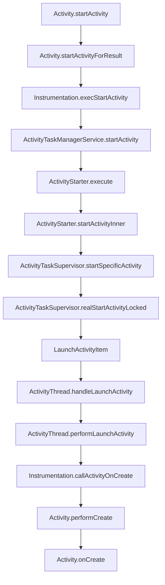

# Activity 启动到 onCreate 流程专精知识

## 核心结论
Activity 从 startActivity 调用到 onCreate 的完整流程涉及 9 个关键层次，通过 Binder 跨进程通信，最终在目标进程中完成 Activity 实例创建和生命周期调用。

## 完整调用链



## 关键类和方法位置

### 1. 应用层
- **Activity.startActivity()**: `/core/java/android/app/Activity.java:6340`
- **Activity.startActivityForResult()**: `/core/java/android/app/Activity.java:5887`

### 2. 工具层
- **Instrumentation.execStartActivity()**: `/core/java/android/app/Instrumentation.java:1958`
- **Instrumentation.callActivityOnCreate()**: `/core/java/android/app/Instrumentation.java:1526`

### 3. 系统层
- **ActivityTaskManagerService.startActivity()**: `/services/core/java/com/android/server/wm/ActivityTaskManagerService.java:1332`
- **ActivityStarter.execute()**: `/services/core/java/com/android/server/wm/ActivityStarter.java:723`
- **ActivityStarter.startActivityInner()**: `/services/core/java/com/android/server/wm/ActivityStarter.java:1750`

### 4. 管理层
- **ActivityTaskSupervisor.startSpecificActivity()**: `/services/core/java/com/android/server/wm/ActivityTaskSupervisor.java:1189`
- **ActivityTaskSupervisor.realStartActivityLocked()**: `/services/core/java/com/android/server/wm/ActivityTaskSupervisor.java:904`

### 5. 事务层
- **LaunchActivityItem.execute()**: `/core/java/android/app/servertransaction/LaunchActivityItem.java:106`

### 6. 运行层
- **ActivityThread.handleLaunchActivity()**: `/core/java/android/app/ActivityThread.java:4143`
- **ActivityThread.performLaunchActivity()**: `/core/java/android/app/ActivityThread.java:3827`

### 7. Activity 生命周期
- **Activity.performCreate()**: `/core/java/android/app/Activity.java:9019`
- **Activity.onCreate()**: 用户重写的生命周期方法

## 关键机制

### 1. 进程决策机制
```java
// ActivityTaskSupervisor.startSpecificActivity()
if (wpc != null && wpc.hasThread()) {
    realStartActivityLocked(r, wpc, andResume, checkConfig);
    return;
}
mService.startProcessAsync(r, knownToBeDead, isTop, hostingType);
```

### 2. 事务创建和发送
```java
// ActivityTaskSupervisor.realStartActivityLocked()
final LaunchActivityItem launchActivityItem = LaunchActivityItem.obtain(...);
mService.getLifecycleManager().scheduleTransactionAndLifecycleItems(
        proc.getThread(), launchActivityItem, lifecycleItem, true);
```

### 3. Activity 实例创建
```java
// ActivityThread.performLaunchActivity()
activity = mInstrumentation.newActivity(cl, component.getClassName(), r.intent);
activity.attach(activityBaseContext, this, getInstrumentation(), ...);
mInstrumentation.callActivityOnCreate(activity, r.state);
```

## 性能优化要点

1. **进程复用**：AMS 先检查目标进程是否已存在
2. **事务批量**：使用 ClientTransaction 批量执行生命周期操作
3. **配置预加载**：HardwareRenderer.preload() 等资源预加载
4. **ClassLoader 优化**：复用 Context 的 ClassLoader

## 常见问题定位

1. **启动失败**：检查 Instrumentation.checkStartActivityResult()
2. **权限问题**：ActivityTaskManagerService 权限验证
3. **ANR**：realStartActivityLocked 中的暂停检查
4. **进程未创建**：检查 startProcessAsync 调用

## 设计模式

1. **委托模式**：Activity → Instrumentation → AMS
2. **事务模式**：ClientTransaction 生命周期事务
3. **单例模式**：ActivityThread 每个进程一个实例
4. **观察者模式**：Instrumentation.Monitor 监控

## 扩展功能
- 支持 Activity 启动性能分析
- 可定制启动流程修改方案
- 适用于 Android 14 (APK 34) 及以上版本

此 Skill 是 AOSP Analysis Skills 的一部分，持续更新维护。