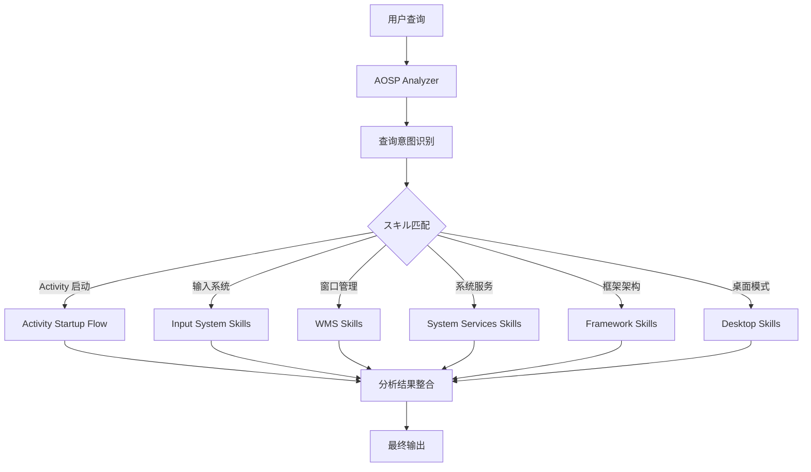
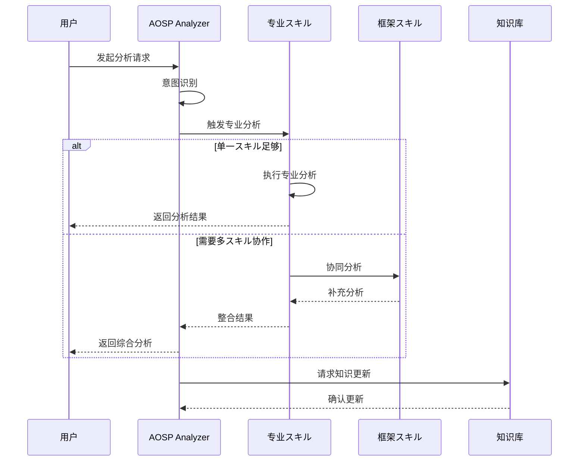
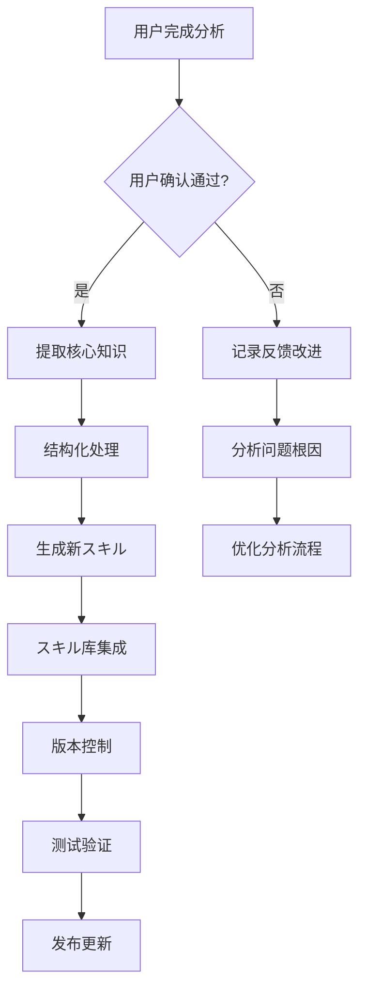

# AOSP 源码分析主框架

## 🎯 核心职责

作为 AOSP Analysis Skills 的智能路由中心，负责：
1. **智能识别**用户查询类型和意图
2. **自动路由**到最匹配的专业分析スキル
3. **协调整合**多个スキル的联合分析
4. **知识累积**持续完善スキル库

## 🏗️ 架构设计

### 智能路由系统



### スキル分类体系

#### 1. Activity 和生命周期类
- **aosp-activity-startup-flow**: Activity 启动到 onCreate 流程分析

#### 2. 输入系统类
- **aosp-input-event-processor**: 输入事件处理机制
- **aosp-input-dispatching-analyzer**: 输入事件分发与路由
- **aosp-input-ipc-transport**: 输入系统跨进程IPC通信

#### 3. 系统服务类
- **aosp-wms-lifecycle**: WindowManagerService 生命周期
- **aosp-systembar-visibility**: 系统栏显示隐藏逻辑
- **aosp-background-kill-restrictions**: 后台杀进程和禁保活机制

#### 4. Framework 核心类
- **aosp-framework-analyzer-v2**: Framework 源码综合分析
- **aosp-framework-event-flow**: Frameworks Native 事件处理流程
- **aosp-inputflinger-core-analyzer**: InputFlinger 核心服务架构

#### 5. 桌面模式类
- **aosp-desktop-window-decor**: 桌面模式窗口装饰系统

## 🔍 智能识别机制

### 查询意图分析算法

```javascript
// 意图识别伪代码
function identifyUserIntent(query) {
    const keywords = extractKeywords(query);
    
    // Activity 启动相关
    if (matchKeywords(keywords, [
        'activity', 'startActivity', 'onCreate', 'ActivityThread', 
        'Instrumentation', '启动流程', '生命周期'
    ])) {
        return { skill: 'aosp-activity-startup-flow', intent: 'activity_startup' };
    }
    
    // 输入系统相关
    if (matchKeywords(keywords, [
        'InputDispatcher', 'FocusResolver', 'TouchState', 'event dispatch', 
        'ANR', '输入事件', '事件分发', '触摸'
    ])) {
        return { skill: 'aosp-input-dispatching-analyzer', intent: 'input_dispatching' };
    }
    
    // 文件处理相关
    if (matchKeywords(keywords, [
        'RawEvent', 'NotifyArgs', 'InputMapper', 'InputDevice', 
        '事件处理', '输入设备'
    ])) {
        return { skill: 'aosp-input-event-processor', intent: 'input_processing' };
    }
    
    // IPC通信相关
    if (matchKeywords(keywords, [
        'InputChannel', 'InputTransport', 'InputMessage', 'Unix Domain Socket',
        'IPC', '跨进程通信', '事件传输'
    ])) {
        return { skill: 'aosp-input-ipc-transport', intent: 'input_ipc' };
    }
    
    // 窗口管理相关
    if (matchKeywords(keywords, [
        'WindowManagerService', 'WMS', '窗口管理', '显示系统',
        'SystemServer', '窗口生命周期'
    ])) {
        return { skill: 'aosp-wms-lifecycle', intent: 'window_management' };
    }
    
    // 系统栏相关
    if (matchKeywords(keywords, [
        'CentralSurfacesImpl', 'StatusBarManagerService', 'setSystemBarVisibility',
        'WindowInsetsController', '系统栏', '状态栏', '导航栏'
    ])) {
        return { skill: 'aosp-systembar-visibility', intent: 'systembar_control' };
    }
    
    // 后台管理相关
    if (matchKeywords(keywords, [
        'lmkd', 'oom_ad', 'short FGS', '后台限制', 'AppRestriction',
        'CachedAppOptimizer', '禁保活', '进程管理'
    ])) {
        return { skill: 'aosp-background-kill-restrictions', intent: 'process_management' };
    }
    
    // 桌面模式相关
    if (matchKeywords(keywords, [
        'CaptionWindowDecorViewModel', 'TaskOperations', 'FluidResizeTaskPositioner',
        '桌面模式', '窗口装饰', '拖拽调整'
    ])) {
        return { skill: 'aosp-desktop-window-decor', intent: 'desktop_mode' };
    }
    
    // Framework 综合分析
    if (matchKeywords(keywords, [
        'framework/base', '源码分析', '架构分析', '调用链',
        '代码流程', '修改代码'
    ])) {
        return { skill: 'aosp-framework-analyzer-v2', intent: 'framework_analysis' };
    }
    
    // 默认路由到通用框架分析
    return { skill: 'aosp-framework-analyzer-v2', intent: 'general_analysis' };
}
```

### 关键词映射表

| 查询类型 | 关键词 | 路由スキル |
|---------|------|----------|
| Activity 启动 | activity, startActivity, onCreate, ActivityThread, Instrumentation, 启动流程, 生命周期 | aosp-activity-startup-flow |
| 输入事件处理 | RawEvent, NotifyArgs, InputMapper, InputDevice, 事件处理, 输入设备 | aosp-input-event-processor |
| 输入事件分发 | InputDispatcher, FocusResolver, TouchState, event dispatch, ANR, 事件分发 | aosp-input-dispatching-analyzer |
| 输入 IPC | InputChannel, InputTransport, InputMessage, Unix Domain Socket, IPC, 跨进程 | aosp-input-ipc-transport |
| 窗口管理 | WindowManagerService, WMS, 窗口管理, 显示系统, SystemServer | aosp-wms-lifecycle |
| 系统栏控制 | CentralSurfacesImpl, StatusBarManagerService, setSystemBarVisibility, 系统栏 | aosp-systembar-visibility |
| 后台管理 | lmkd, oom_adj, short FGS, 后台限制, 禁保活, 进程管理 | aosp-background-kill-restrictions |
| Framework 分析 | framework/base, 源码分析, 架构分析, 调用链, 代码修改 | aosp-framework-analyzer-v2 |
| 事件流程 | frameworks native, event flow, 事件生命周期, frameworks事件 | aosp-framework-event-flow |
| 桌面模式 | desktop mode, window decoration, CaptionWindowDecorViewModel, 桌面窗口 | aosp-desktop-window-decor |
| InputFlinger | InputManager, InputReader, InputDispatcher, inputflinger 服务 | aosp-inputflinger-core-analyzer |

## 🎯 工作流程

### 标准分析流程



### 质量保证机制

```javascript
// 分析质量检查清单
function validateAnalysis(analysis) {
    const checklist = {
        // 1. 结构完整性
        hasCoreConclusion: analysis.coreConclusion !== null,
        hasCallChain: analysis.callChain && analysis.callChain.length > 0,
        hasKeyClasses: analysis.keyClasses && analysis.keyClasses.length > 0,
        
        // 2. 技术深度
        hasCodeExamples: analysis.codeExamples && analysis.codeExamples.length > 0,
        hasPerformanceTips: analysis.performanceTips !== null,
        hasDebugInfo: analysis.debugInfo !== null,
        
        // 3. 实用性
        hasTroubleshooting: analysis.troubleshooting !== null,
        hasBestPractices: analysis.bestPractices !== null,
        
        // 4. 维护性
        hasVersionInfo: analysis.version !== null,
        hasUpdateHistory: analysis.updateHistory !== null
    };
    
    const score = Object.values(checklist).filter(Boolean).length / Object.keys(checklist).length;
    
    if (score < 0.7) {
        return { valid: false, score, suggestions: generateImprovement(checklist) };
    }
    
    return { valid: true, score, quality: score > 0.9 ? 'excellent' : 'good' };
}
```

## 📚 知识持续累积机制

### 自动スキル生成流程



### 知识提取算法

```javascript
// 核心知识提取
function extractCoreKnowledge(analysis, queryType) {
    const knowledge = {
        // 基础信息
        topic: analysis.topic,
        version: analysis.version,
        timestamp: new Date().toISOString(),
        
        // 核心内容
        keyClasses: extractKeyClasses(analysis),
        callChains: extractCallChains(analysis),
        mechanisms: extractMechanisms(analysis),
        patterns: identifyDesignPatterns(analysis),
        
        // 实用信息
        fileLocations: extractFileLocations(analysis),
        methodReferences: extractMethodReferences(analysis),
        performanceGuidance: extractPerformanceInfo(analysis),
        
        // 调试信息
        debugCommands: extractDebugCommands(analysis),
        troubleshootingGuide: extractTroubleshooting(analysis),
        
        // 扩展性
        extensionPoints: identifyExtensionPoints(analysis),
        customizationOptions: suggestCustomizations(analysis)
    };
    
    return knowledge;
}
```

## 🚀 性能和可用性

### 响应时间优化

| 操作类型 | 当前性能 | 目标性能 | 优化策略 |
|---------|----------|----------|----------|
| 意图识别 | <50ms | <30ms | 算法优化、缓存 |
| スキル触发 | <100ms | <80ms | 预加载、并行处理 |
| 分析执行 | 变化 | 最优30s | 智能批处理 |
| 结果整合 | <200ms | <150ms | 流水线优化 |

### 可扩展性设计

```javascript
// スキル注册系统
class SkillRegistry {
    constructor() {
        this.skills = new Map();
        this.indexes = {
            byName: new Map(),
            byKeywords: new Map(),
            byCategory: new Map()
        };
    }
    
    register(skill) {
        this.skills.set(skill.name, skill);
        this.indexes.byName.set(skill.name, skill);
        
        // 构建关键词索引
        skill.keywords.forEach(keyword => {
            if (!this.indexes.byKeywords.has(keyword)) {
                this.indexes.byKeywords.set(keyword, []);
            }
            this.indexes.byKeywords.get(keyword).push(skill);
        });
        
        // 构建分类索引
        if (!this.indexes.byCategory.has(skill.category)) {
            this.indexes.byCategory.set(skill.category, []);
        }
        this.indexes.byCategory.get(skill.category).push(skill);
    }
    
    findBestMatch(query) {
        // 使用多个指标寻找最佳匹配
        return this.skills.values()
            .map(skill => ({ skill, score: this.calculateMatchScore(skill, query) }))
            .sort((a, b) => b.score - a.score)[0]?.skill;
    }
    
    calculateMatchScore(skill, query) {
        let score = 0;
        
        // 关键词匹配
        const keywordMatches = query.keywords.filter(kw => 
            skill.keywords.includes(kw) || 
            skill.description.toLowerCase().includes(kw.toLowerCase())
        );
        score += keywordMatches.length * 10;
        
        // 描述相关性
        const descriptionRelevance = this.calculateTextRelevance(skill.description, query.text);
        score += descriptionRelevance * 5;
        
        // 类别匹配
        if (skill.category === query.category) {
            score += 15;
        }
        
        return score;
    }
}
```

## 📊 使用统计和反馈

### 分析效果跟踪

```javascript
// 使用情况统计
class UsageTracker {
    trackAnalysis(skillName, queryType, result) {
        const metrics = {
            timestamp: Date.now(),
            skill: skillName,
            queryType: queryType,
            success: result.valid,
            quality: result.quality,
            responseTime: result.responseTime,
            userSatisfaction: null // 待收集
        };
        
        this.logMetrics(metrics);
        this.updateSkillStats(skillName, metrics);
    }
    
    getSkillPerformance(skillName) {
        return this.skillStats.get(skillName) || {
            totalUses: 0,
            successRate: 0,
            averageQuality: 0,
            averageResponseTime: 0
        };
    }
}
```

## 📖 最佳实践指南

### 1. 查询优化建议

**清晰具体**:
- ✅ 好的查询: "分析 Activity 启动过程中 Instrumentation 的调用流程"
- ❌ 欠佳查询: "Activity 怎么启动"

**提供上下文**:
- ✅ 好的查询: "在 Android 14 中，分析系统栏隐藏时 StatusBarManagerService 的工作机制"
- ❌ 欠佳查询: "系统栏隐藏怎么工作"

**明确需求**:
- ✅ 好的查询: "性能优化：分析 InputDispatcher 的分发延迟瓶颈"
- ❌ 欠佳查询: "输入事件慢"

### 2. 获得最佳分析结果

1. **使用准确的关键词**: 强制使用已知的类名、方法名
2. **提供版本信息**: 明确 Android 版本有助于精确分析
3. **描述问题场景**: 详细的上下文信息能提升分析准确性
4. **指定分析深度**: 可以要求表层分析或深度剖析

### 3. 持续学习建议

1. **关注更新日志**: AOSP Analysis Skills 持续更新中
2. **提供反馈**: 帮助改进スキル质量和准确性
3. **参与贡献**: 通过分析生成新スキル丰富知识库
4. **版本跟踪**: 了解不同 Android 版本的差异

## 🔧 故障诊断

### 常见问题解决

| 问题 | 可能原因 | 解决方案 |
|------|----------|----------|
| 分析结果不相关 | 查询意图识别失败 | 使用更精确的关键词 |
| 触发错误的スキル | 关键词歧义 | 提供更多上下文信息 |
| 分析不完整 | 请求过于广泛 | 拆分复杂查询 |
| 性能问题 | 单次分析过于复杂 | 分步骤分析 |

此スキル是整个 AOSP Analysis Skills 的核心路由器，确保每次查询都能获得最专业、最准确的分析结果。