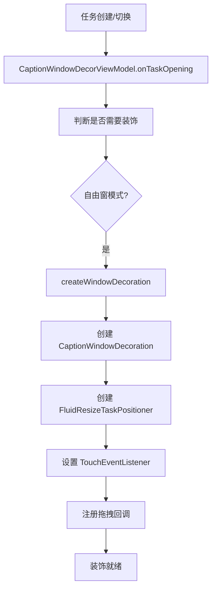
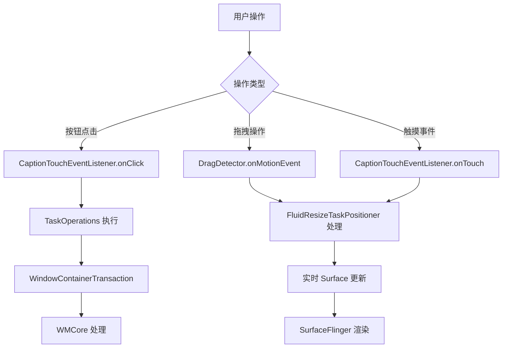
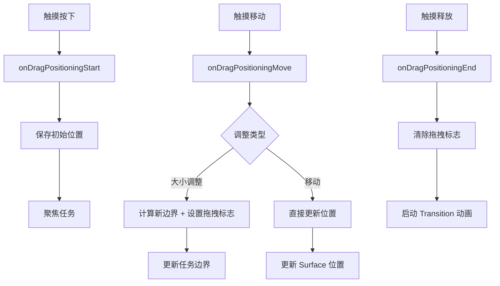
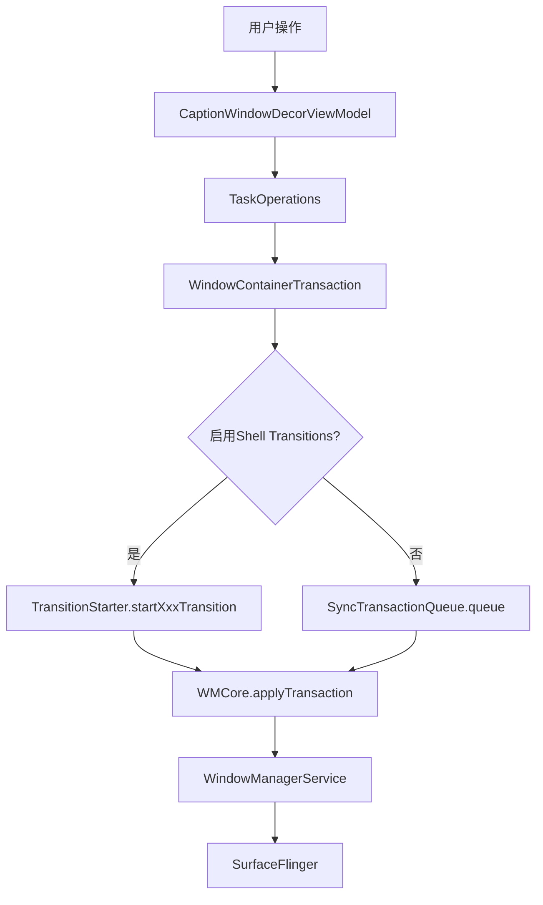

# Android 桌面模式窗口装饰系统专精知识

## 核心结论
Android 桌面模式下的窗口装饰系统由四个核心类组成，共同实现了自由窗窗口的标题栏、边框装饰、拖拽调整、任务操作等完整的桌面窗口交互体验。

## 核心类职责分工

### 1. CaptionWindowDecorViewModel - 窗口装饰主控类
**位置**: `/libs/WindowManager/Shell/src/com/android/wm/shell/windowdecor/CaptionWindowDecorViewModel.java:64`

**主要功能**:
- 创建和管理窗口装饰（标题栏、边框等）
- 处理窗口装饰的生命周期（创建、更新、销毁）
- 集成系统服务（StatusBar、TaskCaptionOperation）
- 处理应用特定配置（强制最大化、竖屏限制等）

**关键方法**:
```java
// 创建窗口装饰
private void createWindowDecoration(RunningTaskInfo taskInfo, SurfaceControl taskSurface,
        SurfaceControl.Transaction startT, SurfaceControl.Transaction finishT)

// 更新窗口装饰（延迟执行避免频繁刷新）
private void updateWindowDecorationDelay(long delay)

// 任务操作处理
void executeTaskOperation(int taskId, int operationType) {
    if(operationType == WmShellCaller.OPERATION_CLOSE){
        closeTaskWithMagicWindow(taskInfo);
    } else if(operationType == WmShellCaller.OPERATION_MAXIMIZE){
        mTaskOperations.maximizeTask(taskInfo);
    }
}
```

### 2. TaskOperations - 任务操作执行器
**位置**: `/libs/WindowManager/Shell/src/com/android/wm/shell/windowdecor/TaskOperations.java:42`

**主要功能**:
- 执行窗口模式切换（全屏/自由窗）
- 管理任务生命周期（关闭、最小化）
- 注入输入事件（Back键等）
- 通过 WindowContainerTransaction 执行操作

**关键实现**:
```java
// 最大化/还原任务
void maximizeTask(RunningTaskInfo taskInfo) {
    WindowContainerTransaction wct = new WindowContainerTransaction();
    int targetWindowingMode = taskInfo.getWindowingMode() != WINDOWING_MODE_FULLSCREEN
            ? WINDOWING_MODE_FULLSCREEN : WINDOWING_MODE_FREEFORM;
    wct.setWindowingMode(taskInfo.token, targetWindowingMode);
    if (targetWindowingMode == WINDOWING_MODE_FULLSCREEN) {
        wct.setBounds(taskInfo.token, null);  // 全屏模式清除边界
    }
}

// 关闭任务（带动画支持）
void closeTask(WindowContainerToken taskToken) {
    WindowContainerTransaction wct = new WindowContainerTransaction();
    wct.removeTask(taskToken);
    if (Transitions.ENABLE_SHELL_TRANSITIONS) {
        mTransitionStarter.startRemoveTransition(wct);
    } else {
        mSyncQueue.queue(wct);
    }
}
```

### 3. FluidResizeTaskPositioner - 流畅拖拽调整器
**位置**: `/libs/WindowManager/Shell/src/com/android/wm/shell/windowdecor/FluidResizeTaskPositioner.java:55`

**主要功能**:
- 处理窗口的拖拽移动和大小调整
- 实时更新 Surface 位置和大小
- 支持 Magic Window 同步调整
- 使用 Shell Transition 处理动画

**核心流程**:
```java
// 拖拽开始
public Rect onDragPositioningStart(int ctrlType, float x, float y) {
    // 保存初始状态
    mTaskBoundsAtDragStart.set(taskBounds);
    mRepositionStartPoint.set(x, y);
    // 如果是调整大小操作，聚焦任务
    if (mCtrlType != CTRL_TYPE_UNDEFINED && !taskInfo.isFocused) {
        WindowContainerTransaction wct = new WindowContainerTransaction();
        wct.reorder(taskInfo.token, true);
    }
    return mRepositionTaskBounds;
}

// 拖拽移动中（实时更新）
public Rect onDragPositioningMove(float x, float y) {
    if (isResizing()) {
        // 调整大小：首次设置拖拽标志，更新边界
        if (!mHasDragResized) {
            wct.setDragResizing(taskInfo.token, true);
            mHasDragResized = true;
        }
        wct.setBounds(taskInfo.token, newBounds);
    } else {
        // 纯移动：直接更新 Surface 位置
        t.setPosition(surface, x, y);
    }
    // 同步处理 Magic 窗口
    updateMagicTaskBounds(...);
}

// 拖拽结束（应用最终状态）
public Rect onDragPositioningEnd(float x, float y) {
    // 清除拖拽标志
    wct.setDragResizing(taskInfo.token, false);
    // 启动过渡动画
    mTransitions.startTransition(TRANSIT_CHANGE, wct, this);
}
```

### 4. DragPositioningCallbackUtility - 拖拽计算工具
**位置**: `/libs/WindowManager/Shell/src/com/android/wm/shell/windowdecor/DragPositioningCallbackUtility.java:37`

**主要功能**:
- 计算拖拽增量
- 处理不同方向的边界调整
- 位置设置应用

**关键方法**:
```java
// 计算拖拽位移
static PointF calculateDelta(float inputX, float inputY, PointF repositionStartPoint)

// 调整边界（支持四边调整）
static boolean changeBounds(int ctrlType, Rect repositionTaskBounds,
        Rect taskBoundsAtDragStart, Rect stableBounds, PointF delta,
        DisplayController displayController, WindowDecoration windowDecoration)
```

## 完整工作流程

### 1. 窗口创建流程


### 2. 用户交互流程


### 3. 拖拽调整细节流程


## Magic Window 支持

### Magic Window 同步机制
多个类都集成了 Magic Window 处理逻辑：
```java
// 获取 Magic 窗口信息
RunningTaskInfo magicTaskInfo = getMagicTaskBounds(mainTaskInfo, bounds, targetBounds);

// 同步操作主窗口和 Magic 窗口
wct.setBounds(mainTaskInfo.token, bounds);
if (magicTaskInfo != null) {
    wct.setBounds(magicTaskInfo.token, targetBounds);
}

// 关闭/最小化时同步处理
void closeTaskWithMagicWindow(RunningTaskInfo info) {
    mTaskOperations.closeTask(info.token);
    // 同时关闭关联的 Magic 窗口
    if (info.magicWindowType != 0) {
        RunningTaskInfo magicTaskInfo = getMagicTaskInfo(info);
        if (magicTaskInfo != null) {
            mTaskOperations.closeTask(magicTaskInfo.token);
        }
    }
}
```

## 配置驱动功能

### 应用特定配置读取
通过 `CompatibleConfig` 查询应用配置：
```java
// 强制启动最大化
String forcedMaximize = queryStringValueData(packageName, "forcedMaximizeStart", activityName);
if (TextUtils.equals(forcedMaximize, "true")) {
    // 禁用退出全屏或强制保持最大化
}

// 强制竖屏模式
String forcedPortrait = queryStringValueData(packageName, "forcedPortraitMode", "");
if (TextUtils.equals(forcedPortrait, "true")) {
    // 禁止退出全屏
    Toast.show(R.string.forbid_exit_full_screen_tips);
    return;
}
```

## 性能优化要点

1. **延迟刷新**：窗口装饰更新使用 delay 机制避免频繁操作
2. **批量事务**：使用 WindowContainerTransaction 批量操作
3. **Surface 直接操作**：拖拽时直接更新 Surface 避免中间层开销
4. **标志位优化**：避免重复设置相同的拖拽标志

## 常见问题定位

1. **拖拽卡顿**：检查 DragResizing 标志设置和清理
2. **Magic 窗口不同步**：确认 getMagicTaskBounds 返回值
3. **装饰不显示**：检查 shouldShowWindowDecor 判断条件
4. **动画闪烁**：确保 Transition 开始时机正确

## 相关类位置总结

- **CaptionWindowDecorViewModel**: `/libs/WindowManager/Shell/src/com/android/wm/shell/windowdecor/CaptionWindowDecorViewModel.java`
- **TaskOperations**: `/libs/WindowManager/Shell/src/com/android/wm/shell/windowdecor/TaskOperations.java`
- **FluidResizeTaskPositioner**: `/libs/WindowManager/Shell/src/com/android/wm/shell/windowdecor/FluidResizeTaskPositioner.java`
- **DragPositioningCallbackUtility**: `/libs/WindowManager/Shell/src/com/android/wm/shell/windowdecor/DragPositioningCallbackUtility.java`

## TaskOperations 窗口操作流程和原理

### 一、TaskOperations 核心作用

TaskOperations 是 Android 窗口操作的核心执行器，负责处理用户通过窗口装饰发起的各种操作，如最大化、最小化、关闭、返回等。它通过 WindowContainerTransaction 与 WMCore 协调来执行实际的窗口管理操作。

### 二、操作原理架构



### 三、WindowContainerTransaction 机制

WindowContainerTransaction 是 Android 窗口事务的核心抽象，代表一组需要原子性执行的窗口容器操作。

#### 事务结构（/core/java/android/window/WindowContainerTransaction.java:60）
```java
public final class WindowContainerTransaction implements Parcelable {
    // 存储所有变更（按容器token索引）
    private final ArrayMap<IBinder, Change> mChanges = new ArrayMap<>();

    // 存储层次操作（如reorder）
    private final ArrayList<HierarchyOp> mHierarchyOps = new ArrayList<>();
}
```

#### 关键方法调用链：
1. **setWindowingMode()** → 设置窗口模式（全屏/自由窗）
2. **setBounds()** → 设置窗口边界
3. **removeTask()** → 标记任务移除
4. **reorder()** → 调整任务在栈中的顺序

### 四、输入事件注入机制

TaskOperations 还能模拟硬件按键，主要用于 Back 按钮功能：

```java
void injectBackKey(int displayId) {
    // 按键按下
    sendBackEvent(KeyEvent.ACTION_DOWN, displayId);
    // 按键释放
    sendBackEvent(KeyEvent.ACTION_UP, displayId);
}

private void sendBackEvent(int action, int displayId) {
    // 创建系统级按键事件
    final KeyEvent ev = new KeyEvent(when, when, action, KeyEvent.KEYCODE_BACK,
            0 /* repeat */, 0 /* metaState */, KeyCharacterMap.VIRTUAL_KEYBOARD,
            0 /* scancode */, KeyEvent.FLAG_FROM_SYSTEM | KeyEvent.FLAG_VIRTUAL_HARD_KEY,
            InputDevice.SOURCE_KEYBOARD);

    ev.setDisplayId(displayId);

    // 通过InputManager注入到系统
    InputManager im = mContext.getSystemService(InputManager.class);
    im.injectInputEvent(ev, InputManager.INJECT_INPUT_EVENT_MODE_ASYNC);
}
```

此 Skill 是 AOSP Analysis Skills 的一部分，持续更新维护。