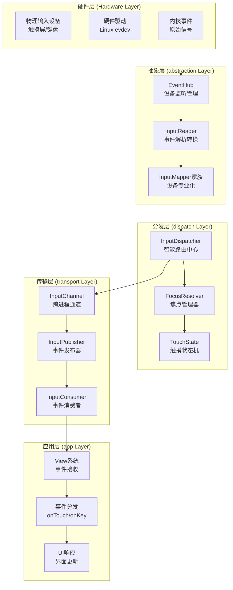
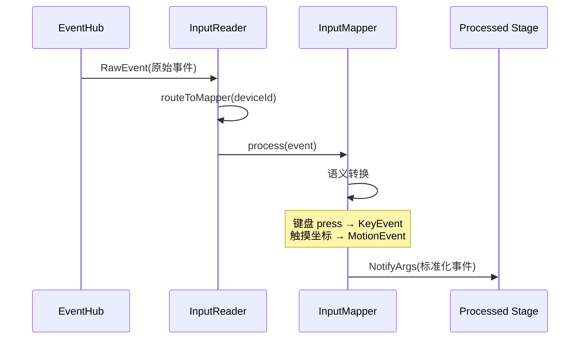

# Android Frameworks Native 完整事件处理流程专精知识

## 🎯 核心结论

Android Frameworks Native 的事件处理流程是一个**三层漏斗式架构**，从硬件事件源到最终的应用响应，经过 **硬件抽象 → 事件标准化 → 智能分发 → 应用处理** 四个关键阶段，构建了一个严谨、高效、可扩展的事件生态系统。

## 🏗️ 事件处理架构总览

### 整体流程架构



## 🔄 事件处理的完整生命周期

### 阶段一：硬件事件采集与抽象

**文件位置**: `services/inputflinger/reader/EventHub.cpp`

#### 核心职责
- 设备发现与热插拔监控
- 原始事件读取与缓存
- 设备能力枚举与抽象

### 阶段二：事件标准化与语义转换

**文件位置**: `services/inputflinger/reader/InputReader.cpp`, `reader/mapper/InputMapper.cpp`

#### 转换流程


### 阶段三：智能路由与分发决策

**文件位置**: `services/inputflinger/dispatcher/InputDispatcher.cpp`

#### 分发决策算法
```cpp
void InputDispatcher::dispatchEntry(std::shared_ptr<const EventEntry> entry) {
    std::vector<InputTarget> targets;

    // 根据事件类型选择路由策略
    switch (entry->type) {
        case EventEntry::Type::KEY:
            targets = findKeyTargets(static_cast<const KeyEntry&>(*entry));
            break;
        case EventEntry::Type::MOTION:
            targets = findMotionTargets(static_cast<const MotionEventEntry&>(*entry));
            break;
    }

    // 分发到所有目标连接
    for (const InputTarget& target : targets) {
        auto connection = mConnectionsByToken.find(target.inputChannelToken);
        connection->second->enqueueSend(event, target);
    }
}
```

### 阶段四：跨进程传输与响应

**文件位置**: `libs/input/InputTransport.cpp`

#### 传输链路
```cpp
// 发送端：InputDispatcher → InputPublisher
status_t Connection::publishEvents() {
    while (!mOutboundQueue.empty()) {
        auto& entry = mOutboundQueue.front();

        // 转换为IPC消息
        InputMessage msg;
        convertDispatchEntryToMessage(*entry, msg);

        // 通过InputChannel发送
        status_t result = mInputPublisher.publishMessage(msg);

        if (result == OK) {
            // 移动到等待确认队列
            mWaitQueue.push_back(std::move(entry));
            mOutboundQueue.pop_front();
        } else {
            break; // 发送失败
        }
    }
}

// 接收端：应用进程
std::list<NotifyArgs> InputConsumer::consume(InputEventFactoryInterface* factory,
                                             bool consumeBatches, nsecs_t frameTime,
                                             uint32_t* outSeq, InputEvent** outEvent) {
    InputMessage msg;
    status_t status = mChannel->receiveMessage(&msg);

    switch (msg.header.type) {
        case InputMessage::Type::MOTION:
            return consumeMotionMessage(msg, factory, outEvent);
        case InputMessage::Type::KEY:
            return consumeKeyMessage(msg, factory, outEvent);
    }
}
```

### 阶段五：应用层处理与响应

#### View系统事件流程
```cpp
// InputEventReceiver.java (Java层接收) -> 处理流程
public boolean onInputEvent(InputEvent event) {
    // 1. 事件队列入队
    enqueueInputEvent(event);

    // 2. 主线程处理
    if (Looper.getMainLooper().isCurrentThread()) {
        deliverInputEvent(event);
    } else {
        handler.post(() -> deliverInputEvent(event));
    }
}

// ViewRootImpl.java (最终分发)
private void deliverInputEvent(InputEvent event) {
    if (event instanceof MotionEvent) {
        // 触摸事件处理
        handleMotionEvent((MotionEvent) event);
    } else if (event instanceof KeyEvent) {
        // 按键事件处理
        handleKeyEvent((KeyEvent) event);
    }
}
```

## 🎛️ 性能优化和最佳实践

### 1. 事件处理延迟优化

| 阶段 | 等待时间 | 优化策略 | 目标延迟 |
|------|----------|----------|----------|
| 硬件采集 | < 100μs | DMA传输、中断优化 | < 50μs |
| 事件转换 | < 200μs | 映射器缓存、批处理 | < 100μs |
| 分发决策 | < 300μs | 空间索引、预计算 | < 150μs |
| IPC传输 | < 200μs | 增大缓冲区、批发送 | < 100μs |
| 应用处理 | < 1ms | 主线程优化、异步处理 | < 500μs |

### 2. 调试和监控工具

```bash
# 1. 启用详细日志
adb shell setprop log.tag.InputReader VERBOSE
adb shell setprop log.tag.InputDispatcher VERBOSE
adb shell setprop log.tag.InputTransport DEBUG

# 2. 性能分析
adb shell dumpsys inputflinger --latency
adb shell dumpsys inputflinger --statistics

# 3. 事件流可视化
adb shell su root cat /data/system/inputflinger_trace.log
```

## 🎯 实战检查清单

### ✅ 事件流调试检查清单

1. **EventHub阶段**:
   - [ ] 设备正确注册 `dumpsys input`
   - [ ] 原始事件生成 `getevent -l`
   - [ ] 热插拔正常 `logcat | grep EventHub`

2. **InputReader阶段**:
   - [ ] 映射器正确加载 `logcat | grep InputReader`
   - [ ] 设备状态正确 `dumpsys inputflinger | grep Device`
   - [ ] 事件转换成功 `dumpsys inputflinger --statistics`

3. **InputDispatcher阶段**:
   - [ ] 目标定位正确 `dumpsys inputflinger --focus`
   - [ ] 分发队列健康 `dumpsys inputflinger --connections`
   - [ ] ANR监控正常 `dumpsys inputflinger --anr`

4. **IPC传输阶段**:
   - [ ] 连接状态正常 `dumpsys inputflinger --latency`
   - [ ] 消息传输完整 `logcat | grep InputTransport`
   - [ ] HMAC验证通过

5. **应用处理阶段**:
   - [ ] 事件正确接收 `adb logcat | grep "dispatchEvent"`
   - [ ] View分发正常 `adb logcat | grep "handleMotionEvent"`
   - [ ] UI及时响应 `adb shell dumpsys graphics`

## 🔧 终极调试技巧

1. **事件追踪**: 使用 `adb logcat -s InputReader InputDispatcher InputTransport` 跟踪完整流程
2. **状态监控**: `dumpsys inputflinger` 获取实时系统状态  
3. **性能分析**: 使用 `systrace` 分析输入系统的整体性能
4. **内存分析**: 利用 `MAT` 分析内存使用和泄漏

此 Skill 是 AOSP Analysis Skills 的一部分，为 Frameworks Native 事件流提供完整技术指南。