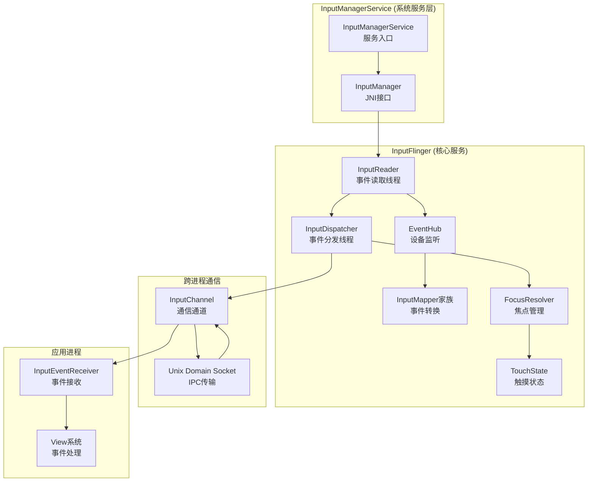

# Android InputFlinger 核心服务架构专精知识

## 核心结论

InputFlinger 是 Android 输入系统的核心服务，通过 InputReader(事件读取) + InputDispatcher(事件分发) 的双线程架构，实现高效、可靠的输入事件处理和路由。

## InputFlinger 服务架构总览

### 顶级架构设计



## 核心服务启动和初始化

### 1. InputManagerService 启动流程

**文件位置**: `frameworks/base/services/core/java/com/android/server/input/InputManagerService.java:396`

**启动调用链**：
```java
// SystemServer 启动
InputManagerService inputManager = 
    new InputManagerService(context, nativeInputManagerService);

// 注册到 ServiceManager
ServiceManager.addService(Context.INPUT_SERVICE, inputManager, false);
```

**构造函数初始化**：
```java
public InputManagerService(Context context, IInputManagerService service) {
    // 创建本地输入管理器
    mPtr = nativeInit(this, context, service.getLooper().getQueue());
    
    // 初始化关键组件
    mDisplayManager = context.getSystemService(DisplayManager.class);
    mWindowManager = context.getSystemService(WindowManager.class);
    mPowerManager = context.getSystemService(PowerManager.class);
    
    // 注册监听器
    mDisplayManager.registerDisplayListener(mDisplayListener, null);
    registerOrientationEventListener();
}
```

### 2. Native 层初始化

**文件位置**: `services/inputflinger/native/com_android_server_input_InputManagerService.cpp:128`

**NativeManager 实现**：
```cpp
static jlong nativeInit(JNIEnv* env, jclass clazz, jobject serviceObj,
                       jobject contextObj, jobject messageQueueObj) {
    // 创建 NativeInputManager
    NativeInputManager* im = new NativeInputManager(env, serviceObj, contextObj, messageQueueObj);
    
    // 创建 EventHub 和核心线程
    im->getInputManager()->initialize();
    
    return reinterpret_cast<jlong>(im);
}

// InputManager 初始化
void InputManager::initialize() {
    // 创建 EventHub
    mEventHub = new EventHub();

    // 创建 InputReader
    mReader = new InputReader(mEventHub, mReaderPolicy);

    // 创建 InputDispatcher  
    mDispatcher = new InputDispatcher(mDispatcherPolicy);

    // 将 Reader 和 Dispatcher 关联
    mDispatcher->setNextListener(this);

    // 启动线程
    mReaderThread = new InputReaderThread(mReader);
    mDispatcherThread = new InputDispatcherThread(mDispatcher);
}
```

### 3. 线程启动和生命周期

**InputReaderThread 实现**:
```cpp
class InputReaderThread : public Thread {
public:
    InputReaderThread(const sp<InputReaderInterface>& reader) :
        Thread(/*canCallJava*/ false), mReader(reader) { }

    virtual bool threadLoop() {
        // 持续处理事件
        mReader->loopOnce();
        return true;
    }
};

class InputDispatcherThread : public Thread {
public:
    InputDispatcherThread(const sp<InputDispatcherInterface>& dispatcher) :
        Thread(/*canCallJava*/ false), mDispatcher(dispatcher) { }

    virtual bool threadLoop() {
        // 持续分发事件
        mDispatcher->dispatchOnce();
        return true;
    }
};
```

## InputReader - 事件读取核心

### 核心工作循环

**文件位置**: `services/inputflinger/reader/InputReader.cpp:314`

```cpp
void InputReader::loopOnce() {
    int32_t timeoutMillis;
    int32_t timeoutMillisRemaining;
    
    // 获取事件
    {
        AutoMutex _l(mLock);
        timeoutMillis = getNextTimeoutLocked();
    }
    
    // 读取原始事件
    size_t eventCount = mEventHub->getEvents(timeoutMillis, &mEventBuffer, EVENT_BUFFER_SIZE);
    
    // 如果有事件，进行处理
    if (eventCount) {
        processEventsLocked(mEventBuffer, eventCount);
    }
    
    // 通知分发器有新事件可用
    if (mEventsNeedWake) {
        mDispatcher->wakeup();
        mEventsNeedWake = false;
    }
    
    // 获取并发布生成的设备配置变更
    {
        AutoMutex _l(mLock);
        mConfigurationSeed = nextConfigurationSeed();
        publishConfigurationChangesLocked();
    }
    
    // 重置读取器警报计时器
    nsecs_t nextWakeupTime = 0;
}
```

### 事件处理流水线


## InputDispatcher - 事件分发核心

### 核心调度循环

**文件位置**: `services/inputflinger/dispatcher/InputDispatcher.cpp:621`

```cpp
void InputDispatcher::dispatchOnce() {
    nsecs_t nextWakeupTime = LONG_LONG_MAX;

    { // 加锁保护区域
        std::scoped_lock _l(mLock);
        mLooper->wake(); // 确保监听器被唤醒
        nsecs_t currentTime = systemTime(SYSTEM_TIME_MONOTONIC);

        // 1. 处理命令队列 (同步执行)
        dispatchCommandsLocked();

        // 2. 分发入队事件 (异步处理)
        if (!mInboundQueue.empty()) {
            std::shared_ptr<const EventEntry> entry = mInboundQueue.front();
            startDispatchCycleLocked(currentTime, entry);
        }

        // 3. 处理超时事件
        nextWakeupTime = processTimeouts(currentTime);
    }

    // 4. 进入等待状态 (自动唤醒)
    if (nextWakeupTime != LONG_LONG_MAX) {
        mLooper->wakeAtTime(nextWakeupTime);
    }
}
```

### 分发决策机制

```cpp
void InputDispatcher::dispatchEventLocked(std::shared_ptr<const EventEntry> entry) {
    std::vector<InputTarget> targets;

    // 根据事件类型选择路由策略
    switch (entry->type) {
        case EventEntry::Type::KEY:
            targets = findKeyTargetsLocked(static_cast<const KeyEntry&>(*entry));
            break;

        case EventEntry::Type::MOTION:
            targets = findMotionTargetsLocked(static_cast<const MotionEventEntry&>(*entry), currentTime);
            break;

        case EventEntry::Type::FOCUS:
            targets = findFocusTargetsLocked(static_cast<const FocusEntry&>(*entry));
            break;
    }

    // 将事件添加到所有目标连接的出队队列
    for (const InputTarget& target : targets) {
        auto connection = mConnectionsByToken.find(target.inputChannelToken);
        if (connection != mConnectionsByToken.end()) {
            connection->second->outboundQueue.push_back(
                createDispatchEntryLocked(entry, target));
        }
    }
}
```

## 服务管理和监控

### 1. 设备管理

```cpp
// 设备添加流程
void InputReader::invokeInputDevicesChangedListenersNotify() {
    // 通知设备列表变更
    for (const auto& listener : mDevicesChangedListeners) {
        listener->notifyInputDevicesChanged(mInputDevices);
    }
}

// 设备移除流程
void InputReader::removeDeviceLocked(int32_t deviceId) {
    InputDevice* device = getDeviceLocked(deviceId);
    if (device) {
        // 移除所有映射器
        device->mMappers.clear();
        
        // 从设备列表中移除
        mDevices.erase(deviceId);
        
        // 回收设备资源
        delete device;
    }
}
```

### 2. 性能监控

```cpp
class InputDispatcherMonitor {
private:
    nsecs_t mLastDispatchTime;
    uint32_t mDispatchCount;
    
public:
    void recordDispatchTime(nsecs_t dispatchTime) {
        mLastDispatchTime = dispatchTime;
        mDispatchCount++;
        
        // 性能预警
        if (dispatchTime > 2000_000) { // 超过2ms
            ALOGW("Dispatch latency high: %.2f ms", dispatchTime / 1000000.0);
        }
    }
    
    void dumpStatistics() {
        ALOGI("Total dispatches: %u", mDispatchCount);
        ALOGI("Average latency: %.2f ms", getTotalLatency() / mDispatchCount / 1000000.0);
    }
};
```

## 关键配置和调优

### 1. 队列大小配置

```cpp
// InputDispatcher 队列配置
namespace InputDispatcherConfig {
    // 入队队列最大大小
    const size_t MAX_INBOUND_QUEUE_SIZE = 1000;
    
    // 出队队列最大大小
    const size_t MAX_OUTBOUND_QUEUE_SIZE = 500;
    
    // 等待队列最大大小
    const size_t MAX_WAIT_QUEUE_SIZE = 500;
}
```

### 2. 超时配置

```cpp
// 超时配置
namespace TimeoutConfig {
    // 默认分发超时 (5秒)
    const nsecs_t DEFAULT_DISPATCHING_TIMEOUT = 5000 * 1000000LL;
    
    // Key 事件超时 (2秒)
    const nsecs_t KEY_DISPATCHING_TIMEOUT = 2000 * 1000000LL;
    
    // Motion 事件超时 (2秒)
    const nsecs_t MOTION_DISPATCHING_TIMEOUT = 2000 * 1000000LL;
    
    // ANR 检测超时 (5秒)
    const nsecs_t ANR_TIMEOUT = 5000 * 1000000LL;
}
```

## 调试和诊断

### 1. 系统服务命令

```bash
# 查看完整状态
dumpsys input

# 查看设备信息
dumpsys inputflinger --verbose

# 查看性能统计
dumpsys inputflinger --statistics

# 查看延迟分析
dumpsys inputflinger --latency

# 查看 ANR 信息
dumpsys inputflinger --anr
```

### 2. 日志输出控制

```bash
# 启用详细日志
setprop log.tag.InputReader VERBOSE
setprop log.tag.InputDispatcher VERBOSE

# 启用性能日志
setprop log.tag.InputEventLatency DEBUG

# 查看实时日志
adb logcat -s InputReader InputDispatcher
```

## 常见问题诊断

### 问题1：事件不响应

**诊断步骤**:
1. 检查 InputThread 是否正常运行
2. 验证 EventHub 设备注册状态
3. 检查 InputDispatcher 目标定位
4. 查看 ANR 检测日志

### 问题2：性能问题

**优化策略**:
1. 减少队列长度
2. 优化输入映射器查找
3. 调整批处理大小
4. 启用性能监控

### 问题3：设备热插拔问题

**处理流程**:
1. 检查 inotify 监听状态
2. 验证设备文件访问权限
3. 查看日志中的设备事件
4. 测试设备移除和重新添加

## 架构扩展点

### 1. 自定义输入设备支持

```cpp
// 创建新的输入映射器
class CustomInputMapper : public InputMapper {
public:
    std::list<NotifyArgs> process(const RawEvent* rawEvent) override {
        std::list<NotifyArgs> out;
        
        // 处理自定义事件类型
        if (rawEvent->type == EV_CUSTOM) {
            NotifyMotionArgs args;
            args.action = AMOTION_EVENT_ACTION_DOWN;
            args.pointerCount = 1;
            // ... 自定义逻辑
            out.push_back(args);
        }
        
        return out;
    }
    
    uint32_t getSources() const override {
        return AINPUT_SOURCE_CUSTOM;
    }
};
```

### 2. 自定义分发策略

```cpp
// 自定义分发策略
class CustomDispatchPolicy : public DispatchPolicy {
    std::vector<InputTarget> selectTargets(const EventEntry& entry) override {
        // 实现自定义路由逻辑
        return {};
    }
};
```

此 Skill 是 AOSP Analysis Skills 的一部分，为理解 InputFlinger 核心架构提供专业技术支持。