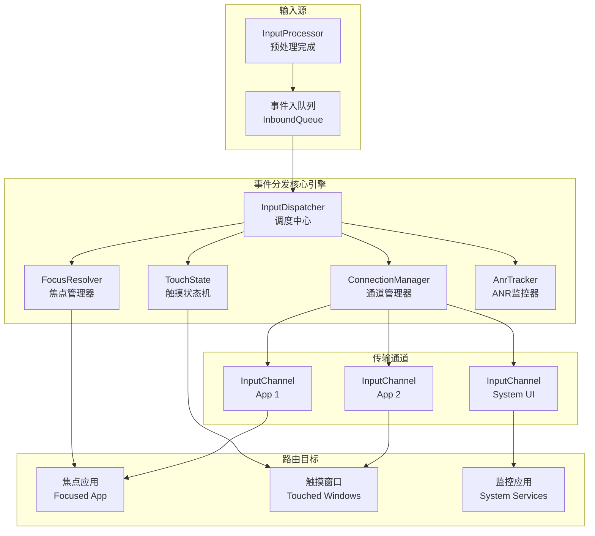
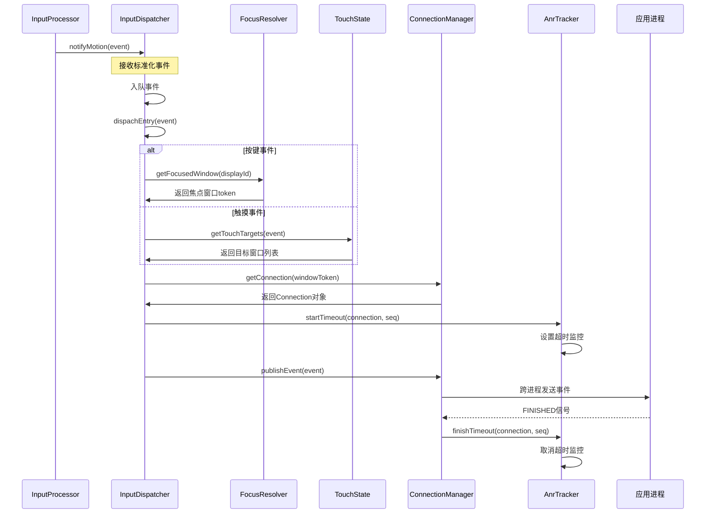

# Android 输入事件分发与路由专精知识

## 🎯 核心结论

Android 输入事件分发采用**智能路由引擎**架构，通过 InputDispatcher(调度中心) + FocusResolver(焦点管理器) + TouchState(触摸状态机) + Connection(通道管理) 的协同，实现高效、安全的事件路由到目标应用。

## 🏗️ 分发系统架构概览

### 整体架构图



### 关键设计原则

**1. 路由决策分离**: 焦点管理和触摸管理独立运行
**2. 状态驱动分发**: 基于目标窗口的实时状态做路由
**3. 响应性保证**: ANR机制确保系统响应性
**4. 通道隔离**: 每个应用独立的输入通道

## 📦 核心组件深度分析

### 1. InputDispatcher - 事件调度中心

**文件位置**: `services/inputflinger/dispatcher/InputDispatcher.cpp`

**核心职责**:
- 接收预处理事件的标准化事件
- 执行目标窗口发现和路由决策
- 管理事件队列的优先级和时序
- 监控应用响应性和处理超时

**关键数据结构**:
```cpp
class InputDispatcher {
private:
    // 事件队列管理 - 不同生命周期阶段
    std::deque<std::shared_ptr<const EventEntry>> mInboundQueue;  // 入队队列
    std::deque<std::unique_ptr<Command>> mCommandQueue;           // 命令队列

    // 连接和通道管理
    std::unordered_map<sp<IBinder>, std::shared_ptr<Connection>>
        mConnectionsByToken;  // Token -> Connection 映射

    // 状态管理器
    std::unique_ptr<FocusResolver> mFocusResolver;  // 焦点解析器
    std::unordered_map<int32_t, TouchState> mTouchStatesByDisplay; // 触摸状态

    // 监控组件
    std::unique_ptr<AnrTracker> mAnrTracker;     // ANR跟踪器
    std::unique_ptr<LatencyTracker> mLatencyTracker; // 延迟跟踪器

    // 配置参数
    const std::chrono::duration<int64_t> mDefaultInputDispatchingTimeout;  // 分发超时
};
```

**核心调度循环**:
```cpp
void InputDispatcher::dispatchOnce() {
    nsecs_t nextWakeupTime = LONG_LONG_MAX;

    // 获取唤醒事件 (新事件/超时/命令)
    { // 锁保护区域
        std::scoped_lock _l(mLock);
        mLooper->wake(); // 确保监听器被唤醒
        nsecs_t currentTime = systemTime(SYSTEM_TIME_MONOTONIC);

        // 1. 处理命令队列 (同步执行)
        runCommandsLockedInterruptible();

        // 2. 分发入队事件 (异步处理)
        if (!mInboundQueue.empty()) {
            std::shared_ptr<const EventEntry> entry = mInboundQueue.front();
            dispatchEntry(entry);
        }

        // 3. 处理超时事件
        nextWakeupTime = handleTimeouts(currentTime);
    }

    // 4. 进入等待状态 (自动唤醒)
    if (nextWakeupTime != LONG_LONG_MAX) {
        mLooper->wakeAtTime(nextWakeupTime);
    }
}
```

### 2. FocusResolver - 智能焦点管理

**文件位置**: `services/inputflinger/dispatcher/FocusResolver.cpp`

**核心使命**: 决定输入事件的最终接收窗口，处理复杂的多窗口焦点场景。

**焦点管理数据结构**:
```cpp
class FocusResolver {
private:
    // 多显示器焦点管理
    std::unordered_map<int32_t, sp<IBinder>> mFocusedWindowTokenByDisplay;
    std::unordered_map<int32_t, FocusRequest> mFocusRequestByDisplay;
    std::unordered_map<int32_t, Focusability> mLastFocusResultByDisplay;

    // 焦点候选排序
    std::vector<sp<WindowInfoHandle>> mRecentFocusCandidates;

public:
    // 获取当前焦点窗口
    sp<IBinder> getFocusedWindowToken(int32_t displayId) const;

    // 焦点请求处理
    std::optional<FocusChanges> setFocusedWindow(const FocusRequest& request);
    std::optional<FocusChanges> setInputWindows(int32_t displayId,
                                             const std::vector<sp<WindowInfoHandle>>& windows);
};
```

**焦点解析算法**:
```cpp
Focusability FocusResolver::getResolvedFocusWindow(
        const sp<IBinder>& requestedToken,
        const std::vector<sp<WindowInfoHandle>>& windows,
        sp<WindowInfoHandle>& outResolvedWindow) {

    // Step 1: 查找请求的目标窗口
    auto requestedWindow = std::find_if(windows.begin(), windows.end(),
        [&requestedToken](const sp<WindowInfoHandle>& handle) {
            return handle->getToken() == requestedToken;
        });

    if (requestedWindow == windows.end()) {
        return Focusability::NO_WINDOW;  // 请求窗口不存在
    }

    // Step 2: 验证窗口的可焦点性
    Focusability focusability = canWindowReceiveFocus(*requestedWindow);
    if (focusability != Focusability::OK) {
        return focusability;
    }

    // Step 3: 处理特定场景的焦点覆盖
    if (focusability == Focusability::WAIT_FOR_PERMISSION) {
        // 权限场景 (隐私屏幕等)
        return Focusability::WAIT_FOR_PERMISSION;
    }

    // Step 4: 设置解析结果
    outResolvedWindow = *requestedWindow;
    return Focusability::OK;
}
```

**焦点决策优先级系统**:
```cpp
enum class Focusability {
    OK,                    // 可以获得焦点
    NO_WINDOW,              // 目标窗口不存在
    PERMISSION_REQUIRED,    // 需要特殊权限
    WAIT_FOR_PERMISSION,    // 等待权限授予
    DISABLED,               // 窗口被禁用
    RECT_COVERED           // 矩形被其他窗口覆盖
};
```

### 3. TouchState - 触摸手势状态机

**文件位置**: `services/inputflinger/dispatcher/TouchState.cpp`

**核心作用**: 管理复杂的触摸交互状态，包括多点触摸、窗口间手势传递、悬停状态等。

**触摸状态数据结构**:
```cpp
class TouchState {
public:
    // 触摸窗口列表 - 按接收优先级排序
    std::vector<TouchedWindow> windows;

    // 被触摸的设备管理
    std::unordered_set<DeviceId> activeDevices;

    // 手势元数据
    std::optional<nsecs_t> firstDownTime;  // 首次按下时间
    std::optional<nsecs_t> lastMoveTime;   // 最后移动时间
    int32_t activePointerCount = 0;        // 活跃指针数量

    // 手势识别状态
    struct GestureState {
        bool isDragging = false;           // 拖拽状态
        bool isScrolling = false;          // 滚动状态
        bool isZooming = false;            // 缩放状态
        bool isSwiping = false;            // 滑动状态
    } gestureState;
};
```

**触摸窗口记录结构**:
```cpp
struct TouchedWindow {
    sp<WindowInfoHandle> windowHandle;     // 窗口句柄
    InputTarget::DispatchMode dispatchMode; // 分发模式

    // 设备指针映射
    std::unordered_map<DeviceId, std::unordered_set<int32_t>> touchingPointers;
    std::unordered_map<DeviceId, std::unordered_set<int32_t>> hoveringPointers;

    // 窗口特定状态
    std::optional<nsecs_t> firstDownTimeInTarget; // 此窗口首次按下时间
    ftl::Flags<InputTarget::Flags> targetFlags;   // 目标标志

    // 历史交互记录
    std::deque<PointerHistory> pointerHistory;
};
```

**多点触摸状态转移**:
```cpp
void TouchState::process TouchDown(DeviceId deviceId, int32_t pointerId,
                                 const PointerCoords& coords,
                                 const sp<WindowInfoHandle>& targetWindow) {
    // 1. 记录新的触摸点
    activeDevices.insert(deviceId);
    activePointerCount++;

    // 2. 更新目标窗口状态
    TouchedWindow& touchedWindow = findOrCreateTouchedWindow(targetWindow);
    touchedWindow.addTouchingPointer(deviceId, pointerId);

    // 3. 设置首次按下时间
    if (!firstDownTime.has_value()) {
        firstDownTime = systemTime(SYSTEM_TIME_MONOTONIC);
        touchedWindow.firstDownTimeInTarget = *firstDownTime;
    }

    // 4. 更新手势状态 (释放优先级)
    updateGesturePriority(touchedWindow);
}
```

**触摸事件分发策略**:
```cpp
std::vector<sp<WindowInfoHandle>> TouchState::getTouchTargets(
        const MotionEvent& motionEvent) {

    std::vector<sp<WindowInfoHandle>> targets;

    switch (motionEvent.getActionMasked()) {
        case AMOTION_EVENT_ACTION_DOWN:
            // 新的手势开始 - 选择最上层窗口
            targets.push_back(findTopMostWindowAtCoords(motionEvent));
            break;

        case AMOTION_EVENT_ACTION_MOVE:
            // 手势延续 - 使用当前目标列表
            targets = getCurrentTouchTargets();
            break;

        case AMOTION_EVENT_ACTION_POINTER_UP:
            // 部分指针释放 - 保持现有目标
            targets = getCurrentTouchTargets();
            releasePointerFromTargets(motionEvent.getPointerId());
            break;

        case AMOTION_EVENT_ACTION_UP:
        case AMOTION_EVENT_ACTION_CANCEL:
            // 手势结束 - 清理所有目标
            targets = getCurrentTouchTargets();
            reset();
            break;
    }

    return targets;
}
```

### 4. Connection - 应用通道管理

**文件位置**: `services/inputflinger/dispatcher/Connection.h`

**核心功能**: 管理与应用进程的通信通道，确保可靠的事件传输和响应监控。

**连接状态机**:
```cpp
enum class Connection::Status {
    NORMAL,      // 正常通信状态
    BROKEN,      // 连接断开 (错误恢复)
    ZOMBIE       // 已注销 (等待清理)
};
```

**通道生命周期管理**:
```cpp
Connection::Connection(std::unique_ptr<InputChannel> inputChannel,
                       bool monitor, const IdGenerator& idGenerator)
      : status(Status::NORMAL),
        monitor(monitor),
        inputPublisher(std::move(inputChannel), idGenerator) {

    // 初始化状态
    responsive = true;

    // 设置通道回调和错误处理
    inputPublisher.setCallback([this](InputPublisher::Result result,
                                      const std::string& error) {
        handleChannelError(result, error);
    });
}
```

**双队列事件管理**:
```cpp
// 出队队列 - 等待发送到应用的事件
std::deque<std::unique_ptr<DispatchEntry>> outboundQueue;

// 等待队列 - 已发送但未完成的事件
std::deque<std::unique_ptr<DispatchEntry>> waitQueue;

// 队列管理算法
void Connection::publishQueuedEvents() {
    while (!outboundQueue.empty()) {
        auto& entry = outboundQueue.front();

        // 尝试发送事件
        InputPublisher::Result result = inputPublisher.publishEvent(*entry);

        switch (result) {
            case InputPublisher::Result::OK:
                // 发送成功 -> 移动到等待队列
                waitQueue.push_back(std::move(entry));
                outboundQueue.pop_front();
                break;

            case InputPublisher::Result::WOULD_BLOCK:
                // 通道阻塞 -> 暂停发送
                responsive = false;
                return;

            case InputPublisher::Result::CONNECTION_BROKEN:
                // 连接断开 -> 错误恢复
                status = Status::BROKEN;
                handleConnectionBroken();
                return;
        }
    }
}
```

### 5. ANR (Application Not Responding) 机制

**ANR监控架构**:
```cpp
class AnrTracker {
private:
    // 超时事件跟踪
    struct AnrEntry {
        sp<IBinder> connectionToken;     // 应用连接标识
        nsecs_t deadline;               // 超时时间点
        EventEntry::Type eventType;      // 事件类型
        int32_t sequenceNumber;         // 事件序列号
        bool hasBeenNoticed;            // 是否已通知系统
    };

    std::unordered_map<int32_t, AnrEntry> mPendingEvents;  // 待确认事件
    std::chrono::milliseconds mDefaultTimeout{5000};      // 默认5秒超时

public:
    // 开始超时计时
    void startTimeout(const sp<IBinder>& token, int32_t seq,
                     nsecs_t startTime, EventEntry::Type type);

    // 检查并处理超时事件
    std::vector<sp<IBinder>> processTimeouts(nsecs_t currentTime);

    // 取消超时监控 (事件处理完成)
    void finishTimeout(const sp<IBinder>& token, int32_t seq);
};
```

**ANR检测和处理流程**:
```cpp
std::vector<sp<IBinder>> AnrTracker::processTimeouts(nsecs_t currentTime) {
    std::vector<sp<IBinder>> anrApps;

    for (auto it = mPendingEvents.begin(); it != mPendingEvents.end();) {
        auto& entry = it->second;

        if (entry.deadline <= currentTime && !entry.hasBeenNoticed) {
            // 检测到ANR
            LOGW("Input dispatching timed out for app %s, seq=%d, type=%s",
                 connectionName, entry.sequenceNumber,
                 eventTypeToString(entry.eventType).c_str());

            // 记录ANR
            anrApps.push_back(entry.connectionToken);
            entry.hasBeenNoticed = true;

            // 通知系统服务
            notifyInputANR(entry.connectionToken, entry.sequenceNumber,
                          entry.eventType);
        }

        if (entry.hasBeenNoticed && currentTime > entry.deadline + 10_s) {
            // 清理过期的ANR条目
            it = mPendingEvents.erase(it);
        } else {
            ++it;
        }
    }

    return anrApps;
}
```

## 🔄 分发决策流程详解

### 事件路由完整流程



### 事件目标选择算法

```cpp
void InputDispatcher::dispatchEvent(std::shared_ptr<const EventEntry> entry) {
    std::vector<InputTarget> targets;

    switch (entry->type) {
        case EventEntry::Type::KEY:
            targets = findKeyTargets(static_cast<const KeyEntry&>(*entry));
            break;

        case EventEntry::Type::MOTION:
            targets = findMotionTargets(static_cast<const MotionEventEntry&>(*entry));
            break;

        case EventEntry::Type::FOCUS:
            targets = findFocusTargets(static_cast<const FocusEntry&>(*entry));
            break;
    }

    // 将事件添加到所有目标连接的出队队列
    for (const InputTarget& target : targets) {
        auto connection = mConnectionsByToken.find(target.inputChannelToken);
        if (connection != mConnectionsByToken.end()) {
            connection->second->outboundQueue.push_back(
                createDispatchEntry(entry, target));
        }
    }
}
```

## 🎛️ 调试和诊断工具

### 1. 输入分发系统诊断

```bash
# 查看完整的分发状态
dumpsys inputflinger --verbose

# 焦点状态信息
dumpsys inputflinger --focus

# 触摸状态信息
dumpsys inputflinger --touch

# ANR和超时统计
dumpsys inputflinger --anr

# 延迟分析
dumpsys inputflinger --latency

# 连接状态
dumpsys inputflinger --connections
```

### 2. 应用层输入检查

```bash
# 应用的输入通道状态
adb shell dumpsys activity top | grep -A 5 -B 5 "INPUT"

# 应用响应性检查
adb shell dumpsys activity provider inputmethod

# 窗口焦点检查
adb shell dumpsys window displays | grep -i focus
```

### 3. 性能监控脚本

```bash
#!/bin/bash
# input_performance_monitor.sh

echo "=== Input System Performance Monitor ==="

# 监控分发延迟
dumpsys inputflinger --latency | grep "latency"

# 监控队列长度
QUEUE_SIZE=$(dumpsys inputflinger --statistics | grep "queue" | awk '{print $2}')
echo "Queue sizes: $QUEUE_SIZE"

# 监控ANR发生率
ANR_COUNT=$(dumpsys inputflinger --statistics | grep "ANR" | awk '{print $2}')
echo "ANR incidents: $ANR_COUNT"

# 监控通道状态
CONNECTION_COUNT=$(dumpsys inputflinger --connections | grep -c "InputChannel")
echo "Active connections: $CONNECTION_COUNT"
```

## 🚀 高级场景和优化

### 1. 多窗口分发优化

```cpp
// 智能窗口覆盖检测
class SmartOcclusionDetector {
    bool isWindowBlockedByHigherPriority(const sp<WindowInfoHandle>& target,
                                        const std::vector<sp<WindowInfoHandle>>& higherWindows) {
        // 检查语义覆盖 (而不仅是像素覆盖)
        return !canReceiveInputSemantic(target, higherWindows);
    }
};
```

### 2. 低延迟分发模式

```cpp
// 游戏模式的低延迟路径
class GameModeDispatcher {
    void enableLowLatencyMode(const sp<IBinder>& gameAppToken) {
        auto connection = getConnection(gameAppToken);

        // 优化配置
        connection->setBatchSize(1);           // 禁用批处理
        connection->setPreemption(true);       // 高优先级调度
        connection->setDirectPath(true);       // 绕过部分检查
    }
};
```

### 3. 输入安全增强

```cpp
// 恶意应用防护
class SecurityEnhancedDispatcher {
    void validateInputTarget(const sp<IBinder>& targetToken) {
        // 检查窗口覆盖图
        if (isWindowCoveredByMaliciousApp(targetToken)) {
            ALOGW("Blocking input to potentially malicious window");
            return;
        }

        // 检查焦点权限
        if (!hasInputFocusPermission(targetToken)) {
            ALOGW("Rejecting input to unfocused window");
            return;
        }
    }
};
```

## 📊 性能指标和优化

### 关键性能基准

| 指标 | 目标值 | 优化方法 |
|------|--------|----------|
| 分发延迟 | < 2ms | 队列优化、减少锁竞争 |
| 焦点查询时间 | < 0.1ms | 索引优化、缓存策略 |
| 触摸状态更新 | < 0.05ms | 状态机精简 |
| ANR误报率 | < 0.001% | 算法改进、时间窗口调整 |
| 连接建立时间 | < 10ms | 预连接池化 |

### 性能分析工具

```cpp
// 分发延迟分析器
class DispatchLatencyAnalyzer {
    void analyzeLatency(const EventEntry& entry, const std::vector<nsecs_t>& timestamps) {
        nsecs_t totalLatency = timestamps.back() - timestamps.front();

        if (totalLatency > 2000_000) { // 超过2ms
            logLatencyBottleneck(entry, timestamps);
        }
    }

private:
    void logLatencyBottleneck(const EventEntry& entry,
                           const std::vector<nsecs_t>& timestamps) {
        // 分析每个阶段的耗时
        for (size_t i = 1; i < timestamps.size(); ++i) {
            nsecs_t stageTime = timestamps[i] - timestamps[i-1];
            if (stageTime > 500_000) { // 单阶段超过0.5ms
                ALOGW("Bottleneck detected in stage %zu: %.2f ms",
                      i-1, stageTime / 1000000.0);
            }
        }
    }
};
```

## 🎯 常见问题诊断

### 1. 事件不响应

**诊断步骤**:
```bash
# 1. 检查目标应用是否正常
dumpsys activity top | grep -A 10 "APP"

# 2. 检查焦点状态
dumpsys inputflinger --focus | grep "Focused Display"

# 3. 检查输入通道状态
dumpsys inputflinger --connections | grep "APP_PACKAGE"

# 4. 检查应用的ANR状态
am dumpheap <pid> /data/local/tmp/anr_traces.txt
```

### 2. 触摸事件丢失

**Debug 流程**:
```cpp
// 触摸事件跟踪器
class TouchEventTracker {
    void trackTouchEvent(const NotifyMotionArgs& args) {
        static uint32_t lastSequence = 0;

        if (lastSequence > 0 && args.sequenceNumber != lastSequence + 1) {
            ALOGW("Touch event sequence gap detected: %zu -> %u",
                  lastSequence, args.sequenceNumber);
        }

        lastSequence = args.sequenceNumber;
    }
};
```

### 3. 焦点混乱

**修复策略**:
```cpp
// 焦点一致性检查器
class FocusConsistencyChecker {
    void validateFocusState(const FocusResolver& resolver,
                           const std::vector<sp<WindowInfoHandle>>& windows) {
        for (const auto& [displayId, token] : resolver.mFocusedWindowTokenByDisplay) {
            bool found = std::any_of(windows.begin(), windows.end(),
                [token](const sp<WindowInfoHandle>& handle) {
                    return handle->getToken() == token;
                });

            if (!found) {
                ALOGW("Inconsistent focus state: display %d",
                      displayId);
                // 触发焦点重新计算
            }
        }
    }
};
```

---

**🔧 调试专家技巧**:
1. **事件追踪**: 使用 `adb logcat -s InputDispatcher` 查看分发过程
2. **状态监控**: `dumpsys inputflinger` 获取实时系统状态
3. **ANR分析**: 查看 `/data/anr/` 文件获取应用的ANR日志
4. **性能分析**: 使用 `systrace` 分析输入系统的整体性能

**此 Skill 深入解析了Android输入分发系统，为理解复杂的事件路由机制和问题诊断提供专业技术支持。**