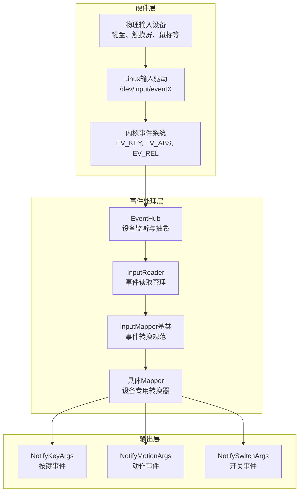
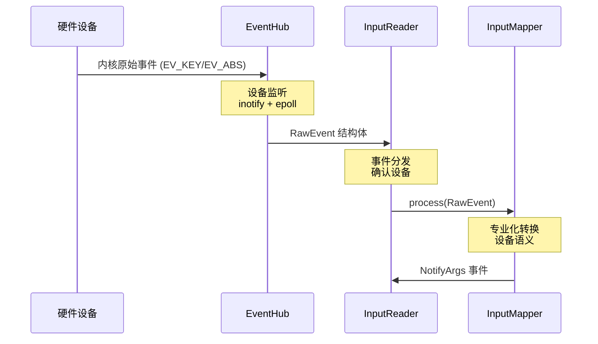
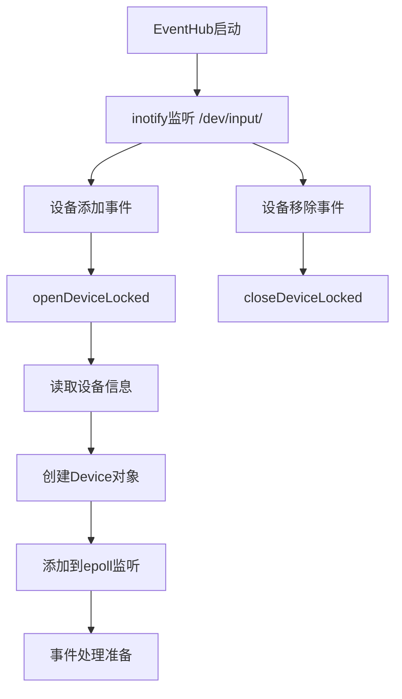
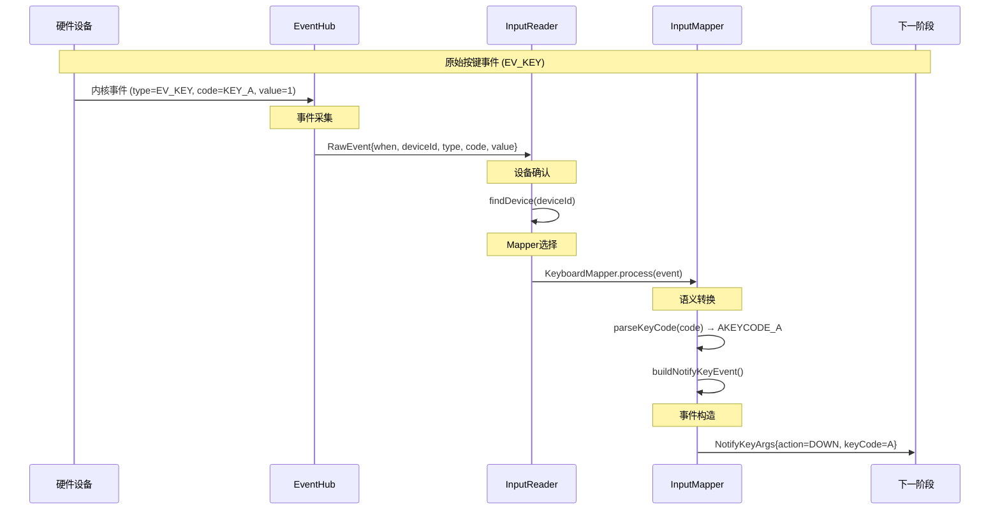

# Android 输入事件处理机制专精知识

## 🎯 核心结论

Android 输入事件处理采用**分层映射架构**，通过 EventHub(硬件抽象) → InputReader(事件解析) → InputMapper(专业转换) 的管道，将原始硬件事件转换为统一的 NotifyArgs 事件格式。

## 🏗️ 事件处理架构概览

### 整体架构图



### 事件流转机制

**1. 硬件事件流**:


## 📦 核心组件深度分析

### 1. EventHub - 硬件事件中心

**文件位置**: `services/inputflinger/reader/EventHub.cpp`

**核心职责**:
- 监听 `/dev/input/` 目录变化 (热插拔)
- 通过 epoll 监听设备文件描述符
- 原始事件的读取和缓存
- 设备的基本信息枚举

**关键数据结构**:
```cpp
// 原始事件结构
struct RawEvent {
    nsecs_t when;        // 事件时间戳
    nsecs_t readTime;    // 读取时间戳 (性能统计)
    int32_t deviceId;   // 设备ID
    int32_t type;       // 事件类型 (EV_KEY, EV_ABS等)
    int32_t code;       // 事件代码
    int32_t value;      // 事件值
};
```

**热插拔监听流程**:


### 2. InputMapper 家族 - 专业化事件转换器

**文件位置**: `services/inputflinger/reader/mapper/`

**类继承体系**:
```cpp
InputMapper [抽象基类]
├── TouchInputMapper [触摸基类]
│   ├── MultiTouchInputMapper [多点触摸]
│   ├── SingleTouchInputMapper [单点触摸]
│   └── TouchpadInputMapper [触摸板]
├── KeyboardInputMapper [键盘输入]
├── CursorInputMapper [光标/鼠标]
├── JoystickInputMapper [游戏手柄]
└── SwitchInputMapper [开关设备]
```

**核心设计原理**:
1. **单职责原则**: 每个 Mapper 专注一种输入类型
2. **可扩展性**: 通过继承支持新的输入设备
3. **状态管理**: 每个维护特定设备的状态信息
4. **配置化**: 支持设备的独立配置参数

### 3. MultiTouchInputMapper - 多点触摸实现

**文件位置**: `services/inputflinger/reader/mapper/MultiTouchInputMapper.cpp`

**核心机制**:
```cpp
class MultiTouchInputMapper : public TouchInputMapper {
private:
    // 多触点累加器 - 处理多点数据
    MultiTouchMotionAccumulator mMultiTouchMotionAccumulator;

    // 指针ID管理 - 跟踪多个触摸点
    BitSet32 mPointerIdBits;              // 当前活跃的指针ID集合
    int32_t mPointerTrackingIdMap[MAX_SLOTS]; // TrackingID到PointerID映射
    bool mHavePointerIds;                 // 是否支持指针ID

public:
    std::list<NotifyArgs> process(const RawEvent* rawEvent) override;
    void syncTouch(nsecs_t when, RawState* outState) override;
};
```

**多点触摸处理流程**:
```cpp
void MultiTouchInputMapper::syncTouch(nsecs_t when, RawState* outState) {
    size_t inCount = mMultiTouchMotionAccumulator.getSlotCount();
    BitSet32 newPointerIdBits;

    for (size_t inIndex = 0; inIndex < inCount; inIndex++) {
        const MultiTouchMotionAccumulator::Slot& inSlot =
            mMultiTouchMotionAccumulator.getSlot(inIndex);

        if (!inSlot.isInUse()) continue;

        // 检查工具类型 (手指、手写笔等)
        if (inSlot.getToolType() == ToolType::PALM) {
            // 手掌检测 - 过滤掉误触
            continue;
        }

        // 获取或分配PointerID
        std::optional<int32_t> pointerId = getActiveBitId(inSlot);
        if (!pointerId.has_value()) {
            pointerId = obtainPointerId(inSlot);
        }

        // 转换坐标和状态
        outState->rawPointerData.pointers[pointerId.value()] =
            convertTouchCoords(inSlot);

        newPointerIdBits.markBit(pointerId.value());
    }

    // 更新活跃指针集合
    outState->rawPointerData.pointerIdBits = newPointerIdBits;
}
```

**关键特性**:
- **Slot协议支持**: 支持Linux Multi-touch Protocol B
- **工具类型识别**: 区分手指、手写笔、手掌等
- **指针跟踪**: 持续跟踪每个触摸点的生命周期
- **坐标转换**: 处理设备坐标到屏幕坐标的映射

### 4. KeyboardInputMapper - 键盘事件处理

**文件位置**: `services/inputflinger/reader/mapper/KeyboardInputMapper.cpp`

**核心功能**:
```cpp
class KeyboardInputMapper : public InputMapper {
private:
    // 按键映射表
    std::shared_ptr<KeyCharacterMap> mKeyboardLayoutMap;

    // 特殊键状态
    int32_t mMetaKeys;    // Meta/Control/Alt状态

    // 旋转映射 (支持设备旋转)
    ui::Rotation mDeviceRotation;

public:
    std::list<NotifyArgs> process(const RawEvent* rawEvent) override;
    void processKeyCode(nsecs_t when, int32_t keyCode, int32_t scanCode,
                       int32_t value, uint32_t policyFlags);
};
```

**按键处理流程**:
```cpp
void KeyboardInputMapper::processKeyDown(nsecs_t when, int32_t scanCode,
                                        int32_t value, uint32_t policyFlags) {
    // 1. 扫描码转换
    int32_t keyCode = getLinuxEventKeyCode(scanCode);

    // 2. 特殊键处理
    if (keyCode == AKEYCODE_UNKNOWN) {
        keyCode = getSpecialKeyCode(scanCode);
    }

    // 3. 旋转适配 (平板设备)
    if (mDeviceRotation != ui::ROTATION_0) {
        keyCode = rotateKeyCode(keyCode, mDeviceRotation);
    }

    // 4. 元键状态跟踪
    mMetaKeys |= getMetaStateForKeyCode(keyCode);

    // 5. 策略检查
    if (!mPolicy->isKeyMetaKey(keyCode)) {
        mPolicy->notifyKeyDown(when, getDeviceId(), keyCode, scanCode,
                             policyFlags, mMetaKeys);
    }
}
```

**高级功能**:
- **旋转适配**: 处理设备旋转对按键的影响
- **元键管理**: Control/Alt/Shift等修饰键状态
- **特殊键映射**: 处理媒体键、系统键等
- **国际化支持**: 支持不同键盘布局

## 🔄 事件处理流程详解

### 1. 完整事件转换链



## 🔧 开发和调试工具

### 1. 事件监控系统

```bash
# 查看原始事件流
getevent -l /dev/input/eventX

# 查看keys布局调试
getevent -p /dev/input/eventX

# 强制重新加载配置
inputflinger --reload-configs
```

## 🎛️ 事件分类和处理

### 1. 事件类型映射表

| 内核事件类型 | 处理Mapper | 输出事件类型 | 说明 |
|-------------|-----------|-------------|------|
| EV_KEY      | KeyboardInputMapper | NotifyKeyArgs | 按键事件 |
| EV_ABS + ABS_MT_ | MultiTouchInputMapper | NotifyMotionArgs | 多点触摸 |
| EV_ABS + BTN_TOUCH | SingleTouchInputMapper | NotifyMotionArgs | 单点触摸 |
| EV_REL      | CursorInputMapper | NotifyMotionArgs | 鼠标移动 |
| EV_ABS + ABS_ | JoystickInputMapper | NotifyMotionArgs | 游戏手柄 |
| EV_SW       | SwitchInputMapper | NotifySwitchArgs | 开关状态 |

## 🎯 最佳实践

### 1. 输入设备处理原则

- **设备抽象**: 通过EventHub隐藏硬件差异
- **语义转换**: 从硬件事件到应用语义的清晰映射
- **状态一致性**: 保持设备状态的准确追踪
- **性能优先**: 事件处理路径要高效

此 Skill 是 AOSP Analysis Skills 的一部分，持续更新维护。