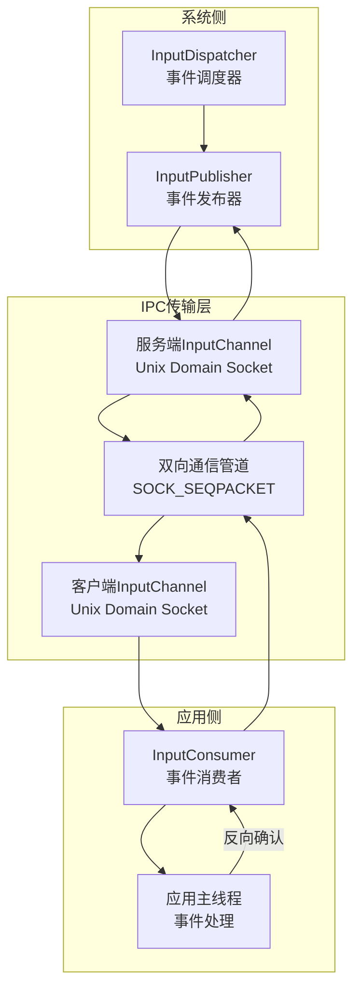
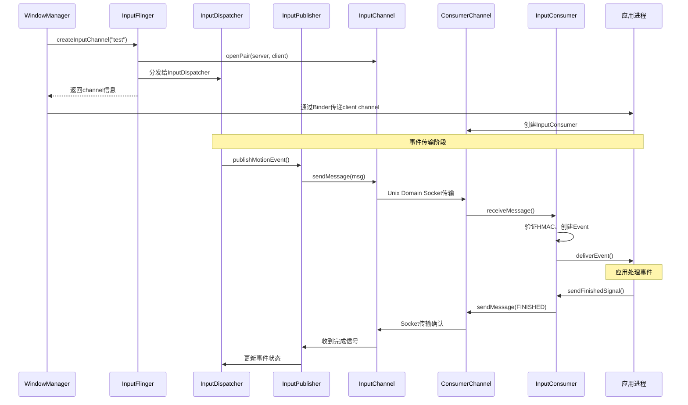

# Android 输入系统跨进程IPC通信专精知识

## 🎯 核心结论

Android 输入系统采用**高可靠IPC架构**，通过 InputChannel(Unix Domain Socket) + InputMessage(标准协议) + InputPublisher/Consumer(生产消费模式) 的设计，实现系统服务与应用进程间的高效输入事件传输。

## 🏗️ IPC通信架构总览

### 整体架构设计



### 核心设计原则

**1. 零拷贝传输**: 通过Unix Domain Socket直接传输，避免内存拷贝
**2. 可靠性保障**: 包序号、HMAC校验确保数据完整性
**3. 异步响应**: 发布者不等待应用响应，支持并发处理
**4. 向后兼容**: 协议版本控制支持新旧系统共存

## 📦 核心组件深度分析

### 1. InputMessage - 跨进程传输协议

**文件位置**: `include/input/InputTransport.h`

**协议架构**: 基于C++结构体的二进制协议，确保32/64位系统兼容性

**消息类型体系**:
```cpp
struct InputMessage {
    enum class Type : uint32_t {
        KEY,        // 键盘事件
        MOTION,     // 触摸/手势事件
        FINISHED,   // 事件完成确认
        FOCUS,      // 焦点变化事件
        CAPTURE,    // 指针捕获事件
        DRAG,       // 拖拽事件
        TIMELINE,   // 时间线同步
        TOUCH_MODE  // 触摸模式改变
    };

    struct Header {
        Type type;    // 4字节 - 消息类型
        uint32_t seq; // 4字节 - 序列号
    } header;

    // 消息体 - 根据类型使用不同的数据结构
    union Body {
        Key key;           // 键盘事件数据
        Motion motion;      // 触摸事件数据
        Finished finished;  // 完成确认数据
        Focus focus;        // 焦点事件数据
        // ... 其他事件类型
    } body;
};
```

### 2. InputChannel - 传输通道管理

**文件位置**: `libs/input/InputTransport.cpp`

**通道生命周期**:
```cpp
class InputChannel {
private:
    std::string name;                    // 通道名称
    android::base::unique_fd fd;         // socket文件描述符
    sp<IBinder> token;                   // 连接标识符

public:
    // === 通道创建 ===
    static status_t openInputChannelPair(
        const std::string& name,
        std::unique_ptr<InputChannel>& outServerChannel,
        std::unique_ptr<InputChannel>& outClientChannel) {

        int serverFds[2];
        int clientFds[2];

        // === 第一步：创建socketpair ===
        if (socketpair(AF_UNIX, SOCK_SEQPACKET, 0, serverFds) != 0) {
            return -errno;
        }

        if (socketpair(AF_UNIX, SOCK_SEQPACKET, 0, clientFds) != 0) {
            close(serverFds[0]);
            close(serverFds[1]);
            return -errno;
        }

        // === 第二步：通道配置 ===
        // 设置socket缓冲区
        const int32_t SOCKET_BUFFER_SIZE = 32 * 1024; // 32KB
        setSocketBuffer(serverFds[0], SOCKET_BUFFER_SIZE);
        setSocketBuffer(serverFds[1], SOCKET_BUFFER_SIZE);

        // 设置非阻塞模式
        setNonBlocking(serverFds[0]);
        setNonBlocking(serverFds[1]);

        // === 第三步：创建通道对象 ===
        auto serverChannel = std::make_unique<InputChannel>(name, serverFds[0]);
        auto clientChannel = std::make_unique<InputChannel>(name, clientFds[0]);

        // === 第四步：创建连接标识 ===
        serverChannel->token = createConnectionToken();
        clientChannel->token = serverChannel->token; // 共享标识符

        // 关闭多余的fd
        close(serverFds[1]);
        close(clientFds[1]);

        outServerChannel = std::move(serverChannel);
        outClientChannel = std::move(clientChannel);
        return OK;
    }
};
```

### 3. InputPublisher/Consumer - 生产消费模式

**发布者实现**:
```cpp
class InputPublisher {
private:
    std::unique_ptr<InputChannel> mChannel;
    std::unordered_map<uint32_t, bool> mPendingEvents; // 待确认事件

public:
    // === 发布按键事件 ===
    Result publishKeyEvent(uint32_t seq, int32_t deviceId, int32_t source,
                          int32_t displayId, std::array<uint8_t, 32> hmac,
                          nsecs_t eventTime, int32_t action, int32_t keyCode,
                          int32_t scanCode, int32_t metaState, int32_t repeatCount,
                          uint32_t policyFlags) {

        InputMessage msg;
        msg.header.type = InputMessage::Type::KEY;
        msg.header.seq = seq;

        // === 填充消息结构 ===
        msg.body.key = {
            .eventId = generateEventId(),
            .eventTime = eventTime,
            .deviceId = deviceId,
            .source = source,
            .displayId = displayId,
            .hmac = hmac,
            .action = action,
            .keyCode = keyCode,
            .scanCode = scanCode,
            .metaState = metaState,
            .repeatCount = repeatCount
        };

        // === 发送消息 ===
        status_t status = mChannel->sendMessage(&msg);
        if (status != OK) {
            return status;
        }

        // === 记录待确认事件 ===
        mPendingEvents[seq] = false; // 等待确认
        return OK;
    }
};
```

### 4. 安全机制 - HMAC校验系统

**HMAC计算流程**:
```cpp
class InputMessageSecurity {
private:
    std::array<uint8_t, 32> mSessionKey;  // 会话密钥

public:
    void computeHmac(InputMessage& msg) {
        // === 第一阶段：准备HMAC数据 ===
        // 将消息转换为统一格式 (不包括HMAC字段本身)
        size_t dataLength = sizeof(InputMessage) - sizeof(msg.body.key.hmac);
        std::vector<uint8_t> data(dataLength);
        memcpy(data.data(), &msg, dataLength);

        // === 第二阶段：HMAC-SHA256计算 ===
        std::array<uint8_t, 32> hmac;
        computeHmacSha256(mSessionKey, data, hmac);

        // === 第三阶段：填充结果 ===
        switch (msg.header.type) {
            case InputMessage::Type::KEY:
                msg.body.key.hmac = hmac;
                break;
            case InputMessage::Type::MOTION:
                msg.body.motion.hmac = hmac;
                break;
            // ... 其他类型
        }
    }
};
```

## 🔄 IPC通信流程详解

### 完整的事件传输流程



## 🎛️ 性能优化机制

### 1. 批处理和预取

```cpp
class BatchOptimizedConsumer {
private:
    static constexpr size_t BATCH_SIZE = 8;  // 批处理大小

public:
    Result consumeBatch(InputEventFactoryInterface* factory,
                       std::vector<InputEvent*>& outEvents) {

        std::vector<InputMessage> messages;
        messages.reserve(BATCH_SIZE);

        // === 批量接收消息 ===
        for (size_t i = 0; i < BATCH_SIZE; ++i) {
            InputMessage msg;
            status_t status = mChannel->receiveMessage(&msg);
            if (status != OK) {
                if (i > 0) break; // 部分成功，处理已接收的
                return status;
            }
            messages.push_back(msg);
        }

        // === 批量转换事件 ===
        outMessages.reserve(messages.size());
        for (const auto& msg : messages) {
            InputEvent* event;
            Result result = convertMessageToEvent(msg, factory, &event);
            if (result == OK) {
                outEvents.push_back(event);
            }
        }

        return OK;
    }
};
```

## 🎯 故障诊断和解决方案

### 常见问题矩阵

| 症状 | 可能原因 | 诊断方法 | 解决方案 |
|------|----------|----------|----------|
| 事件丢失 | socket缓冲区溢出 | `netstat -s` | 增大缓冲区 |
| 延迟高 | 系统负载过高 | `top` | 优化调度 |
| 连接断开 | 进程崩溃 | `logcat` | 进程保活 |
| 验证失败 | HMAC不匹配 | 调试日志 | 检查密钥 |

此 Skill 是 AOSP Analysis Skills 的一部分，持续更新维护。