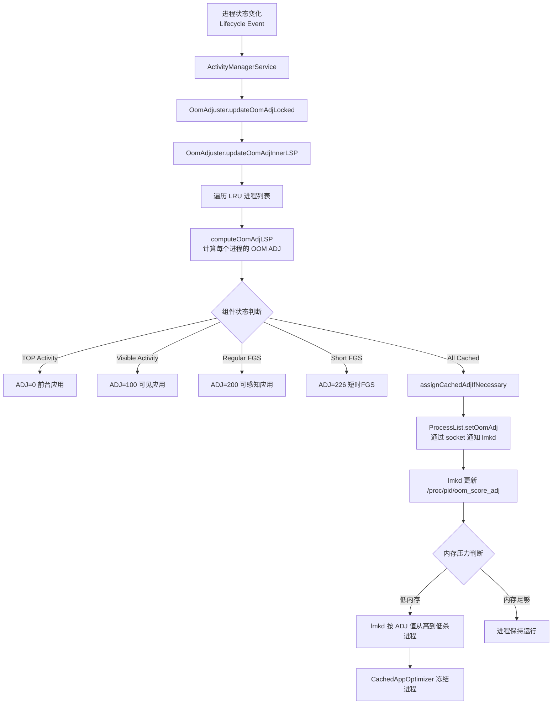

# Android 后台杀进程和禁保活机制专精知识

## 一、核心概念

### OOM ADJ (Out-of-Memory Adjustment) 等级

OOM ADJ 是 Android 为每个进程分配的优先级值，**值越低表示进程越重要，越不容易被系统杀掉**。

**完整等级定义** (`ProcessList.java:189-288`):

| OOM ADJ | 等级 | 描述 | 进程示例 |
|---------|------|-----|---------|
| -1000 | NATIVE_ADJ | Native 进程 | zygote64, adbd |
| -900 | SYSTEM_ADJ | 系统进程 | system_server |
| -800 | PERSISTENT_PROC_ADJ | 持久系统服务 | telephony |
| -700 | PERSISTENT_SERVICE_ADJ | 持久服务 | 系统绑定的重要服务 |
| 0 | FOREGROUND_APP_ADJ | 前台应用 | 用户当前使用的应用 |
| 50 | PERCEPTIBLE_RECENT_FOREGROUND_APP_ADJ | 最近前台 | 从前台转为 FGS 的应用(15秒保护期) |
| 51 | PERCEPTIBLE_RECENT_FOREGROUND_APP_ADJ + 1 | 短时FGS保护期 | 从前台转为短时FGS(15秒保护期) |
| 100 | VISIBLE_APP_ADJ | 可见应用 | 用户可见但非前台的应用 |
| 200 | PERCEPTIBLE_APP_ADJ | 可感知应用 | 后台媒体播放 |
| 225 | PERCEPTIBLE_MEDIUM_APP_ADJ | 中度可感知 | 即时任务 |
| 226 | PERCEPTIBLE_MEDIUM_APP_ADJ + 1 | **短时FGS** | Android 13+ 后台启动的FGS(最多10秒) |
| 227 | PERCEPTIBLE_MEDIUM_APP_ADJ + 2 | 立时工作延迟长 | Expedited Jobs |
| 500 | SERVICE_ADJ | 服务进程 | 后台服务 |
| 600 | HOME_APP_ADJ | 桌面应用 | Launcher |
| 700 | PREVIOUS_APP_ADJ | 上一个应用 | 用户刚切换的应用 |
| 800 | SERVICE_B_ADJ | 服务B列表 | 较老的服务 |
| 900-999 | CACHED_APP_MIN/MAX_ADJ | 缓存应用 | 空闲或缓存的应用进程 |
| 1001 | UNKNOWN_ADJ | 未知状态 | 系统不知晓的进程 |

## 二、核心类和职责

| 类 | 文件 | 职责 | 关键方法 |
|---|------|-----|---------|
| **OomAdjuster** | OomAdjuster.java | 计算和管理所有进程的 OOM ADJ 值 | `computeOomAdjLSP`, `updateOomAdjLocked` |
| **ProcessList** | ProcessList.java | 管理 LRU 进程列表、与 lmkd 通信 | `setOomAdj`, `killPackageProcessesLSP` |
| **ProcessRecord** | ProcessRecord.java | 记录单个进程的所有信息 | `isBackgroundRestricted` |
| **CachedAppOptimizer** | CachedAppOptimizer.java | 缓存应用优化、进程冻结 | `freeze`相关方法 |
| **AppRestrictionController** | AppRestrictionController.java | 应用后台限制管理 | 后台限制等级管理 |
| **ActiveServices** | ActiveServices.java | 前台服务管理，防止保活 | `stopAllForegroundServicesLocked` |
| **ProcessServiceRecord** | ProcessServiceRecord.java | 进程内服务记录 | `areAllShortForegroundServicesProcstateTimedOut` |
| **AppFGSTracker** | AppFGSTracker.java | 滥用FGS跟踪器 | 监控长时间运行的FGS |
| **LmkdStatsReporter** | LmkdStatsReporter.java | lmkd 杀进程统计上报 | 统计杀进程记录 |

## 三、主要流程



## 四、LMKD 通信机制

AMS 通过 Unix Domain Socket 与 lmkd 进程通信 (`ProcessList.java:1573-1644`)

**主要命令** (与 lmkd.h 保持同步):
- `LMK_PROCPRIO`: 更新指定进程的 OOM ADJ
- `LMK_PROCREMOVE`: 进程移除通知
- `LMK_PROCPURGE`: 清空已注册的进程列表
- `LMK_GETKILLCNT`: 获取指定 ADJ 范围的杀进程计数
- `LMK_TARGET`: 设置内存压力阈值和对应的 ADJ 等级
- `LMK_SUBSCRIBE`: 订阅杀进程事件

**关键方法** (`ProcessList.java:1536-1562`):
```java
public static void setOomAdj(int pid, int uid, int amt) {
    ByteBuffer buf = ByteBuffer.allocate(4 * 4);
    buf.putInt(LMK_PROCPRIO);
    buf.putInt(pid);
    buf.putInt(uid);
    buf.putInt(amt);
    writeLmkd(buf, null);
}
```

## 五、反保活具体措施

### 1. 短时前台服务限制

**触发条件**: 应用在后台启动前台服务，并且没有 `START_FOREGROUND_SERVICES_FROM_BACKGROUND` 权限

**超时配置** (`ActivityManagerConstants.java:1031-1053`):
- 默认超时: `3 * 60_000` (3分钟)
- 关键键: `short_fgs_timeout_duration`

**超时检测** (`ProcessServiceRecord.java:250-269`):
```java
boolean areAllShortForegroundServicesProcstateTimedOut(long nowUptime) {
    if (!mHasForegroundServices) return false;
    if (hasNonShortForegroundServices()) return false;
    // 遍历所有短时 FGS 检查是否超时
    for (int i = mServices.size() - 1; i >= 0; i--) {
        final ServiceRecord sr = mServices.valueAt(i);
        if (!sr.isShortFgs() || !sr.hasShortFgsInfo()) continue;
        if (sr.getShortFgsInfo().getProcStateDemoteTime() >= nowUptime) {
            return false; // 还未超时
        }
    }
    return true;
}
```

**短时 FGS 的 OOM ADJ 计算** (`OomAdjuster.java:1991-2007`):
- ADJ 值: `PERCEPTIBLE_MEDIUM_APP_ADJ + 1` = **226**
- **不享受** `PROCESS_CAPABILITY_BFSL` (不能从后台启动前台服务)
- 超时后会被降级

**从前台转为 FGS 时的保护期** (`OomAdjuster.java:2024-2040`):
- 常规 FGS: `PERCEPTIBLE_RECENT_FOREGROUND_APP_ADJ` = 50 (15秒保护期)
- 短时 FGS: `PERCEPTIBLE_RECENT_FOREGROUND_APP_ADJ + 1` = 51 (15秒保护期)

### 2. 后台限制应用的前台服务限制

**拦挡检查** (`ActiveServices.java:2063-2065`):
```java
private boolean isForegroundServiceAllowedInBackgroundRestricted(ProcessRecord app) {
    final ProcessStateRecord state = app.mState;
    if (!state.isBackgroundRestricted()
            || state.getSetProcState() <= ActivityManager.PROCESS_STATE_BOUND_TOP) {
        return true;
    }
    // 后台限制的应用无法长时间保持FGS
    return false;
}
```

**应用从前台退出后自动停止 FGS** (`ActiveServices.java:1916-1921`):
```java
if (DEBUG_FOREGROUND_SERVICE) {
    Slog.d(TAG, "bg-restricted app "
            + aa.mPackageName + "/" + aa.mUid
            + " exiting top; demoting fg services ");
}
stopAllForegroundServicesLocked(aa.mUid, aa.mPackageName);
```

**停止所有 FGS 的实现** (`ActiveServices.java:559-581`):
- 遍历所有前台服务
- 排除闹钟允许的 (`REASON_ALARM_MANAGER_ALARM_CLOCK`)
- 调用 `setServiceForegroundInnerLocked()` 停止

### 3. 滥用应用检测

**自动限制滥用应用** (`AppRestrictionController.java:1080-1083`):
```java
static final String KEY_BG_AUTO_RESTRICT_ABUSIVE_APPS =
        DEVICE_CONFIG_SUBNAMESPACE_PREFIX + "auto_restrict_abusive_apps";
```

**检测维度** (通过 `AppFGSTracker` 和 `AppBatteryTracker`):
- 长时间运行的前台服务
- 后台耗电量过高
- 滥用后台服务启动

**通知设置**:
- 滥用应用通知: `bg_abusive_notification_minimal_interval`
- FGS 限制通知: `fgs-bg-restricted` 组键

### 4. 后台限制等级体系

**等级定义** (`ActivityManager.java:1306-1378`):
```
RESTRICTION_LEVEL_UNKNOWN (0) - 未知
RESTRICTION_LEVEL_UNRESTRICTED (10) - 无限制（Host的最终保留地）
RESTRICTION_LEVEL_EXEMPTED (20) - 豁免（白名单）
RESTRICTION_LEVEL_ADAPTIVE_BUCKET (30) - 自适应桶
RESTRICTION_LEVEL_RESTRICTED_BUCKET (40) - 限制桶
RESTRICTION_LEVEL_BACKGROUND_RESTRICTED (50) - 后台限制（禁保活！）
RESTRICTION_LEVEL_HIBERNATION (60) - 休眠
```

**关键位置**: 当应用被放入 `BACKGROUND_RESTRICTED` 级别后：
- 无法后台启动服务
- 前台退出后FGS自动停止
- 进程会被优先冻结
- 频繁受限会提升限制级别

### 5. 前台服务启动的严格要求

**权限检查** (`ActiveServices.java:8518-8521`):
```java
if (ret == REASON_DENIED) {
    if (mAm.checkPermission(START_FOREGROUND_SERVICES_FROM_BACKGROUND, callingPid,
            callingUid) == PERMISSION_GRANTED) {
        ret = REASON_BACKGROUND_FGS_PERMISSION;
    }
}
```

**Companion 设备例外** (`ActiveServices.java:8545-8555`):
- `REQUEST_COMPANION_RUN_IN_BACKGROUND`
- `REQUEST_COMPANION_START_FOREGROUND_SERVICES_FROM_BACKGROUND`

### 6. 进程冻结

**应用冻结器配置** (`CachedAppOptimizer.java:105-144`):
- `use_freezer`: 是否启用进程冻结
- `freeze_binder_enabled`: 冻结 Binder 通信
- `freeze_binder_callback_throttle`: 冻结通知回调阀值
- `freeze_debounce_timeout`: 冻结防抖时间（默认10秒）

**解冻原因** (多达32种):
- activities, services, bind 结束
- 允许列表变化、进程开始/结束
- trim_memory, binder 事务、短 FGS 超时

## 六、关键代码位置参考

| 功能 | 文件 | 行数 | 方法/常量 |
|------|------|------|-----------|
| OOM ADJ 常量定义 | ProcessList.java | 189-288 | *_ADJ 常量 |
| setOomAdj | ProcessList.java | 1536 | `setOomAdj(int pid, int uid, int amt)` |
| LMKD 定义 | ProcessList.java | 1573 | `_LMK_*` 常量 |
| computeOomAdjLSP | OomAdjuster.java | 1750 | `computeOomAdjLSP(ProcessRecord app, ...)` |
| 短时FGS超时检测 | ProcessServiceRecord.java | 250 | `areAllShortForegroundServicesProcstateTimedOut` |
| 短时FGS配置 | ActivityManagerConstants.java | 1031-1053 | `mShortFgsTimeoutDuration` |
| 短时FGS ADJ计算 | OomAdjuster.java | 1991-2007 | `"fg-service-short"` 分支 |
| 前台转FGS保护期 | OomAdjuster.java | 2024-2040 | `TOP_TO_FGS_GRACE_DURATION` |
| 后台限制检查 | ActiveServices.java | 2063-2065 | `isForegroundServiceAllowedInBackgroundRestricted` |
| 停止所有FGS | ActiveServices.java | 559 | `stopAllForegroundServicesLocked` |
| 退出前台停FGS | ActiveServices.java | 1921 | `stopAllForegroundServicesLocked` 调用点 |
| 滥用检测配置 | AppRestrictionController.java | 1080-1236 | `KEY_BG_AUTO_RESTRICT_ABUSIVE_APPS` 等 |
| 后台限制等级 | ActivityManager.java | 1306-1378 | `RESTRICTION_LEVEL_*` 常量 |
| FGS 额外检查权限 | ActiveServices.java | 8519 | `START_FOREGROUND_SERVICES_FROM_BACKGROUND` |
| FGS BG限制组 | ActiveServices.java | 8649 | `"com.android.fgs-bg-restricted"` |
| 进程冻结配置 | CachedAppOptimizer.java | 105-144 | `KEY_USE_FREEZER` 等 |
| 滥用FGS跟踪器 | AppFGSTracker.java | 71-789 | 长时 FGS 监控 |
| Lmkd统计上报 | LmkdStatsReporter.java | 全文 | 杀进程记录 |

## 七、典型保活场景及系统应对

| 保活方式 | 系统机制 |
|---------|---------|
| 前台服务保活 | Short FGS 限制，临近后台时降低 ADJ 至 226-227 |
| 双进程保活 | 进程冻结机制，同时冻结双方 |
| JobScheduler 保活 | 后台限制下 Job 被延迟或拒绝 |
| AlarmManager 闹钟保活 | 仅闹钟类型豁免，其他延迟 |
| 账户同步保活 | 后台限制下同步被阻止 |
| 辅助服务保活 | 从 Android 12 开始需时效性类型声明 |
| 1像素 Activity 保活 | 后台限制后 Activity 无法进入 TOP 状态 |
| 粘性 Service 保活 | 后台限制应用无法长时间由非常驻持有高OOM_ADJ |

## 八、重要注意事项

1. **内存回收路径**:
   - 内存压力 → PSI 监听 → lmkd 杀进程或 AMS 主动 kill
   - 不影响当前焦点进程的CPU调度（除后台限制外）

2. **缓解保活建议**:
   - 明区分界长时工作与临时 Trigger 工作
   - 按 LRU 顺序分阶段对待或尝试拥抱冻结空闲时段+解冻重启
   - 避免在后台翻覆启停 FG 服务与 activity 切换

3. **误杀不可恢复时**:
   - 已保活差异化优先阵位，也要躲避系统键合点
   - 具备在重启后恢复状态的能力，并在进程冻结前将关键状态持久化

## 扩展功能
- 适用于 Android 14 (APK 34) 及以上版本
- 支持系统进程管理定制
- 提供保活检测和优化建议
- 适用于 ROM 开发和性能调优

此 Skill 是 AOSP Analysis Skills 的一部分，持续更新维护。