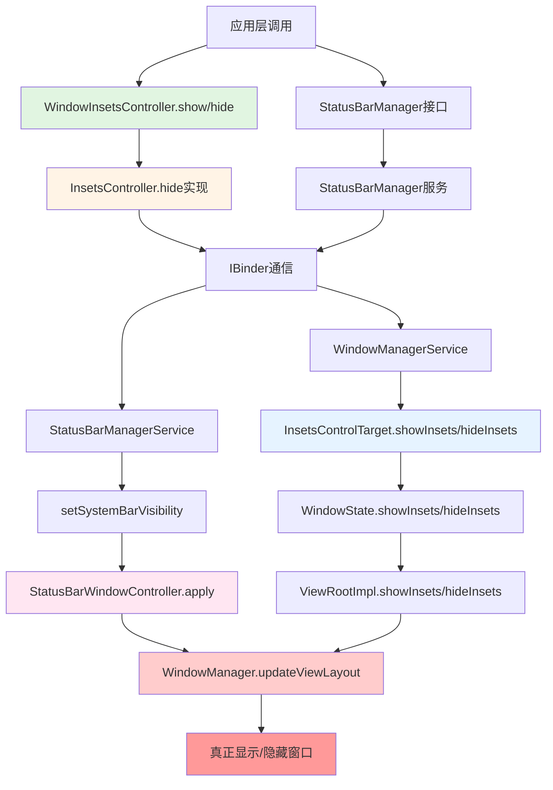

# Android 系统栏显示隐藏专精知识

## 核心调用链分析

### 1. 完整调用流程



### 2. 关键类和方法

#### 应用层接口
- **WindowInsetsController.show(int types)** - 显示系统栏
- **WindowInsetsController.hide(int types)** - 隐藏系统栏
- *参数*: `WindowInsets.Type.statusBars()` | `navigationBars()` | `systemBars()`

#### 系统服务接口
- **StatusBarManager.setSystemBarVisibility(int displayId, int window, int status)** - 控制系统栏可见性
  - window参数: 1=状态栏, 2=导航栏
  - status参数: 0=显示, 1=正在显示, 2=隐藏

#### 系统内部实现
- **InsetsController.hide(int types)** - WindowInsets接口实现（117n行的隐藏功能被禁用）
- **StatusBarManagerService.setSystemBarVisibility()** - 系统服务实现 (1223行)
- **CentralSurfacesImpl.onStatusBarWindowStateChanged()** - SystemUI状态栏窗口状态变化 (309-326行)
- **CentralSurfacesImpl.onNavigationBarVisible()** - SystemUI导航栏可见性变化 (328-343行)
- **StatusBarWindowController.apply()** - 最终执行窗口参数应用 (347-374行)

### 3. 最终执行内容

**真正执行显示/隐藏的核心代码**：
```java
// StatusBarWindowController.java:347-356
private void apply(State state) {
    if (!mIsAttached) {
        return;
    }
    applyForceStatusBarVisibleFlag(state);
    applyHeight(state);
    // 核心：通过WindowManager更新窗口布局
    if (mLp != null && mLp.copyFrom(mLpChanged) != 0) {
        mWindowManager.updateViewLayout(mStatusBarWindowView, mLp);
    }
}
```

**窗口状态控制**：
- `WindowManager.LayoutParams` 参数更新
- `forciblyShownTypes` 强制显示类型设置
- 窗口高度和insets调整
- SurfaceFlinger根据新参数渲染

### 4. 异步特性分析

显示隐藏操作不是瞬时操作的原因：

#### 1. 跨进程通信延迟
```
应用进程 -> Binder IPC -> StatusBarManagerService (system_server进程) 
-> Binder IPC -> SystemUI进程 -> WindowManager提交 -> SurfaceFlinger渲染
```

#### 2. 窗口特性
- **TYPE_STATUS_BAR**: 系统级窗口，需要特殊权限
- **FLAG_NOT_FOCUSABLE**: 不获取焦点但需要布局更新
- **insets提供**: 需要 WindowManager 重新计算布局

#### 3. 动画和状态转换
- 状态转换需要时间: WINDOW_STATE_SHOWING → WINDOW_STATE_HIDING → WINDOW_STATE_HIDDEN
- 可能涉及透明度、位置等动画效果
- 避免太快导致闪烁或用户体验问题

#### 4. 多系统组件协调
- WindowManagerService 窗口管理
- StatusBarManagerService 系统栏服务
- SystemUI 进程执行
- SurfaceFlinger GPU渲染

### 5. 状态获取不准确的原因

#### 技术原因：
1. **异步执行**: 调用接口后，实际显示/隐藏可能在几毫秒到几百毫秒后才完成
2. **多进程延迟**: 至少经过2-3次IPC调用
3. **渲染流水线**: 从布局计算到实际渲染需要多个阶段
4. **状态同步问题**: 不同进程中的状态可能不同步

#### 解决方案：
1. **使用回调监听**: 监听 `StatusBarWindowStateListener.onStatusBarWindowStateChanged()`
2. **延迟获取**: 在调用显示/隐藏后延迟一段时间再获取状态
3. **监听可见性变化**: 通过 `WindowInsetsController.OnControllableInsetsChangedListener`
4. **检查最终状态**: 等待 `WindowInsets.isVisible()` 反映最终状态

### 6. 关键代码位置

**接口定义**:
- `android.view.WindowInsetsController.java` (177-189行)
- `android.app.StatusBarManager.java` (标记为@hide的系统接口)

**核心实现**:
- `android.view.InsetsController.java` (1186-1267行 hide实现)
- `com.android.server.statusbar.StatusBarManagerService.java` (1223-1227行)

**SystemUI执行**:
- `com.android.systemui.statusbar.phone.CentralSurfacesImpl.java` (309-343行)
- `com.android.systemui.statusbar.window.StatusBarWindowController.java` (347-374行)

**窗口状态监听**:
- `com.android.systemui.statusbar.window.StatusBarWindowStateListener.kt` (22-24行)
- `com.android.systemui.statusbar.phone.fragment.CollapsedStatusBarFragment.java` (218-221行)

### 7. 注意事项

1. **权限要求**:
   - WindowInsetsController: 应用层窗口控制权限
   - StatusBarManager: 需要 `android.permission.STATUS_BAR_SERVICE` 系统权限
   - setSystemBarVisibility: @hide标记，仅系统内部使用

2. **隐藏功能禁用**:
   - `InsetsController.hide()` 方法第1187行有 `if(true) return;` 被禁用
   - 可能是调试或特殊配置需要

3. **状态延迟特性**:
   - 显示隐藏操作具有异步特性，无法保证立即生效
   - 需要通过监听器或回调来获取最终状态
   - 不同设备和ROM实现可能有不同的延迟

## 扩展功能
- 适用于 Android 14 (APK 34) 及以上版本
- 支持系统UI定制和状态栏控制
- 提供系统栏显示状态监听方案
- 适用于ROM开发和界面定制

此 Skill 是 AOSP Analysis Skills 的一部分，持续更新维护。