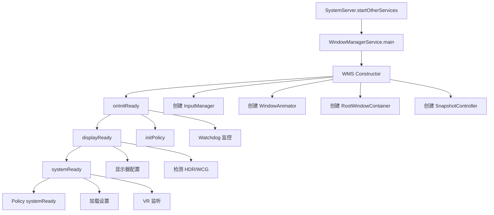

# WindowManagerService 生命周期专精知识

## 核心结论
WindowManagerService (WMS) 作为 Android 窗口管理的核心服务，其生命周期包含启动、初始化、运行、关闭四个主要阶段，负责管理所有窗口的显示、布局、动画和输入事件分发。

## 生命周期阶段

### 1. 启动阶段 (Startup Phase)

#### 1.1 SystemServer 启动位置
- **位置**: `/services/java/com/android/server/SystemServer.java:1667`
- **调用链**: SystemServer.startOtherServices() → WindowManagerService.main()

```java
// SystemServer 中的启动代码
wm = WindowManagerService.main(context, inputManager, !mFirstBoot,
        new PhoneWindowManager(), mActivityManagerService.mActivityTaskManager);
ServiceManager.addService(Context.WINDOW_SERVICE, wm, false,
        DUMP_FLAG_PRIORITY_CRITICAL | DUMP_FLAG_PROTO);
wm.onInitReady();
```

#### 1.2 WindowManagerService.main()
- **位置**: `/services/core/java/com/android/server/wm/WindowManagerService.java:1131`
- **功能**: 在 DisplayThread 中创建 WMS 实例
- **线程**: DisplayThread Handler 调用

```java
public static WindowManagerService main(Context context, InputManagerService im,
        boolean showBootMsgs, WindowManagerPolicy policy, ActivityTaskManagerService atm,
        DisplayWindowSettingsProvider displayWindowSettingsProvider,
        Supplier<SurfaceControl.Transaction> transactionFactory,
        Function<SurfaceSession, SurfaceControl.Builder> surfaceControlFactory) {
    final WindowManagerService[] wms = new WindowManagerService[1];
    DisplayThread.getHandler().runWithScissors(() ->
            wms[0] = new WindowManagerService(context, im, showBootMsgs, policy, atm,
                    displayWindowSettingsProvider, transactionFactory,
                    surfaceControlFactory), 0);
    return wms[0];
}
```

### 2. 构造函数初始化阶段 (Construction Phase)

#### 2.1 基础组件初始化
- **位置**: `/services/core/java/com/android/server/wm/WindowManagerService.java:1160`

##### 核心组件创建：
```java
// 工具类和控制器
mWindowPlacerLocked = new WindowSurfacePlacer(this);
mSnapshotController = new SnapshotController(this);
mTaskSnapshotController = mSnapshotController.mTaskSnapshotController;
mWindowTracing = WindowTracing.createDefaultAndStartLooper(this, Choreographer.getInstance());

// 显示和动画
mAnimator = new WindowAnimator(this);
mRoot = new RootWindowContainer(this);
mSurfaceAnimationRunner = new SurfaceAnimationRunner(mTransactionFactory, mPowerManagerInternal);

// 输入和拖拽
mTaskPositioningController = new TaskPositioningController(this);
mDragDropController = new DragDropController(this, mH.getLooper());

// 其他控制器
mEmbeddedWindowController = new EmbeddedWindowController(mAtmService, inputManager);
mBlurController = new BlurController(mContext, mPowerManager);
mAccessibilityController = new AccessibilityController(this);
mScreenRecordingCallbackController = new ScreenRecordingCallbackController(this);
```

#### 2.2 系统服务集成
- **电源管理**: PowerManager 和 PowerManagerInternal
- **显示管理**: DisplayManagerInternal
- **输入管理**: InputManagerService 传入
- **VR 支持**: IVrManager 注册监听

#### 2.3 配置加载
```java
// 动画缩放设置
mWindowAnimationScaleSetting = getWindowAnimationScaleSetting();
mTransitionAnimationScaleSetting = getTransitionAnimationScaleSetting();
setAnimatorDurationScale(getAnimatorDurationScaleSetting());

// 其他配置
mConstants = new WindowManagerConstants(this, DeviceConfigInterface.REAL);
mConstants.start(new HandlerExecutor(mH));
```

### 3. 初始化就绪阶段 (Ready Phase)

#### 3.1 onInitReady()
- **位置**: `/services/core/java/com/android/server/wm/WindowManagerService.java:1408`
- **执行内容**:
  - 初始化 Policy (PhoneWindowManager)
  - 添加到 Watchdog 监控
  - 创建水印
  - 显示模拟器覆盖层

```java
public void onInitReady() {
    initPolicy();
    Watchdog.getInstance().addMonitor(this);
    createWatermark();
    showEmulatorDisplayOverlayIfNeeded();
}
```

#### 3.2 displayReady()
- **位置**: `/services/core/java/com/android/server/wm/WindowManagerService.java:5345`
- **执行内容**:
  - 设置最大 UI 宽度
  - 应用默认显示属性
  - 动画器就绪
  - 检测广色域和 HDR 支持
  - 重新配置所有显示器

```java
public void displayReady() {
    synchronized (mGlobalLock) {
        if (mMaxUiWidth > 0) {
            mRoot.forAllDisplays(dc -> {
                if (dc.mDisplay.getType() == Display.TYPE_INTERNAL) {
                    dc.setMaxUiWidth(mMaxUiWidth);
                }
            });
        }
        applyForcedPropertiesForDefaultDisplay();
        mAnimator.ready();
        mDisplayReady = true;
        mHasWideColorGamutSupport = queryWideColorGamutSupport();
        mHasHdrSupport = queryHdrSupport();
        mIsTouchDevice = mContext.getPackageManager().hasSystemFeature(
                PackageManager.FEATURE_TOUCHSCREEN);
        mRoot.forAllDisplays(DisplayContent::reconfigureDisplayLocked);
    }
}
```

#### 3.3 systemReady()
- **位置**: `/services/core/java/com/android/server/wm/WindowManagerService.java:5370`
- **执行内容**:
  - 通知 Policy 系统就绪
  - 通知所有显示策略系统就绪
  - 快照控制器就绪
  - 加载设置
  - 注册 VR 模式监听

```java
public void systemReady() {
    mSystemReady = true;
    mPolicy.systemReady();
    mRoot.forAllDisplayPolicies(DisplayPolicy::systemReady);
    mSnapshotController.systemReady();
    UiThread.getHandler().post(mSettingsObserver::loadSettings);
    // VR 模式监听注册
    IVrManager vrManager = IVrManager.Stub.asInterface(
            ServiceManager.getService(Context.VR_SERVICE));
    if (vrManager != null) {
        vrManager.registerListener(mVrStateCallbacks);
    }
}
```

### 4. 运行阶段 (Running Phase)

#### 4.1 窗口管理核心流程
- **addWindow()**: 添加新窗口 (`/services/core/java/com/android/server/wm/WindowManagerService.java:1448`)
- **removeWindow()**: 移除窗口
- **relayoutWindow()**: 重新布局窗口
- **performLayout()**: 执行布局

#### 4.2 调度和动画
- **SurfaceAnimationRunner**: Surface 动画执行
- **WindowAnimator**: 窗口动画管理
- **AppTransition**: 应用切换动画
- **BLASTSyncEngine**: 同步引擎

#### 4.3 输入事件处理
- **InputManagerCallback**: 输入回调
- **InputMonitor**: 输入监控
- **Touch 焦点管理**: 触摸焦点处理

### 5. 关闭阶段 (Shutdown Phase)

#### 5.1 监控和清理
- **Watchdog**: 监控 WMS 响应
- **资源回收**: Surface 和 Window 清理
- **线程停止**: Handler 和 Looper 停止

## 关键生命周期标志位

```java
// 核心状态标志
private boolean mDisplayReady = false;
private boolean mSystemReady = false;
private boolean mWindowManagerReady = false;
```

## 初始化顺序总结



## 各阶段执行的关键内容

### 1. 构造阶段执行内容
- **资源加载**: 读取系统配置和资源
- **组件创建**: 创建所有管理器和控制器
- **服务注册**: 注册到 LocalServices
- **线程创建**: 创建 Handler 和线程池
- **Surface 连接**: 建立 SurfaceFlinger 连接

### 2. 就绪阶段执行内容
- **Policy 初始化**: PhoneWindowManager 初始化
- **显示器配置**: 应用显示器设置
- **系统服务交互**: 与其他系统服务协调
- **功能启用**: 启用动画、截图等功能

### 3. 运行阶段执行内容
- **窗口操作**: 添加、移除、布局窗口
- **动画执行**: 应用转换和系统动画
- **输入处理**: 分发输入事件到窗口
- **显示管理**: 多显示器支持
- **电源管理**: 屏幕开关和亮度调节

## 性能优化要点

1. **延迟初始化**: 部分功能延迟到真正需要时
2. **异步执行**: 使用线程池处理耗时操作
3. **缓存机制**: 配置和资源缓存
4. **批量操作**: 事务性 Surface 操作

## 调试和监控

1. **Watchdog 监控**: 防止 WMS 卡死
2. **Window Tracing**: 跟踪窗口操作
3. **ProtoLog**: 高性能日志记录
4. **Systrace**: 性能跟踪支持

## 扩展功能
- 支持 Android 14 (APK 34) 及以上版本
- 适用于定制 ROM 和系统开发
- 提供窗口动画定制方案
- 输入事件路由优化支持

此 Skill 是 AOSP Analysis Skills 的一部分，持续更新维护。